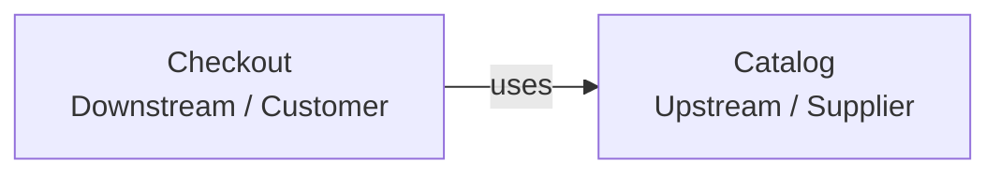

# Arquitectura: Core E-Commerce Checkout con Descuentos Acumulativos

> **Objetivo:** gestionar un carrito de compras y procesar el checkout aplicando un motor de descuentos acumulativos con
> reglas de precedencia y un tope máximo, garantizando consistencia entre el cálculo, el stock y la orden persistida.

---

### Dominio (DDD)

#### Subdominios

| Subdominio                         | Clasificación | Descripción                                                                                |
| :--------------------------------- | :------------ | :----------------------------------------------------------------------------------------- |
| **Proceso de Checkout (Order)**    | _Core_        | Validación de stock, orquestación de la compra y persistencia de la orden confirmada.      |
| **Motor de Descuentos (Discount)** | _Supporting_  | Cálculo secuencial de los descuentos acumulativos, con precedencia estricta y tope máximo. |
| **Catálogo (Catalog)**             | _Supporting_  | Consulta de productos y control del stock disponible.                                      |

El Proceso de Checkout es el subdominio _Core_: completar una compra de forma consistente es lo que el negocio necesita resolver. El Motor de Descuentos y el Catálogo son _Supporting_: existen para que el checkout pueda completarse (saber cuánto cobrar, saber qué hay disponible), pero ninguno de los dos es, por sí mismo, el objetivo del negocio. No existe un subdominio _Generic_: no hay capacidades como autenticación, procesamiento de pagos externos o notificaciones dentro del alcance funcional.

El sistema opera en modalidad monousuario: no existe gestión de usuarios, sesiones ni autenticación. El estado del carrito y el uso de cupones son globales a la aplicación, no están asociados a un cliente identificado — por eso ningún _Aggregate_ del modelo necesita una referencia a un usuario o una sesión.

#### Bounded Contexts

Se identifican dos _Bounded Contexts_:

- **Checkout**: agrupa los subdominios Proceso de Checkout (_Core_) y Motor de Descuentos (_Supporting_). Ambos comparten el mismo lenguaje (`Cart`, `Order`, `DiscountBreakdown`), el mismo ciclo de despliegue y no existe necesidad de un límite de contexto real entre ellos. Internamente se organizan como paquetes independientes (`order` y `discount`), de modo que la distinción _Core_/_Supporting_ quede reflejada en el código sin fragmentar el modelo en dos _Bounded Contexts_ separados.
- **Catalog**: lenguaje y reglas propias (`Product`, `Stock`, `Category`) independientes de las de Checkout.

#### Context Map

`Catalog` es el **_Upstream / Supplier_** porque es el Bounded Context responsable del catálogo de productos y del stock disponible. `Checkout` es el **_Downstream / Customer_** porque utiliza esas capacidades durante el proceso de compra para obtener la información necesaria y gestionar la disponibilidad de los productos.

La relación es **_Customer -> Supplier_** y se representa mediante `uses`, indicando que `Checkout` consume capacidades proporcionadas por `Catalog`. `Catalog` mantiene la autoridad sobre `Product` y `Stock`, mientras `Checkout` los utiliza como parte de la orquestación del checkout.

#### Lenguaje ubicuo

| Término             | Significado                                                                                                                                           |
| :------------------ | :---------------------------------------------------------------------------------------------------------------------------------------------------- |
| `Product`           | Ítem del catálogo con `id`, `name`, `description` (resumen mostrado en la interfaz), `unitPrice`, `category`, `stock`.                                |
| `Stock`             | Cantidad disponible de un producto para la venta.                                                                                                     |
| `Cart`              | Selección de productos y cantidades hecha por el cliente; es la entrada del cálculo de descuentos, sin identidad ni ciclo de vida persistente propio. |
| `DiscountPolicy`    | Configuración ordenada de las reglas de descuento vigentes.                                                                                           |
| `DiscountRule`      | Eslabón que aplica un tipo específico de descuento sobre el resultado acumulado.                                                                      |
| `Coupon`            | Código promocional de un solo uso: una vez aplicado en una compra confirmada, no puede volver a utilizarse.                                           |
| `Subtotal`          | Suma de los precios de los productos del carrito, antes de aplicar cualquier descuento.                                                               |
| `DiscountBreakdown` | Resultado del cálculo: montos por tipo de descuento, porcentaje efectivo, indicador de tope alcanzado y total a pagar.                                |
| `Total`             | Monto final a pagar, resultado de restar el descuento acumulado al subtotal.                                                                          |
| `Order`             | Compra confirmada, con sus líneas, el desglose de descuentos aplicado y el stock ya decrementado.                                                     |

#### Entidades

| Entidad                  | Tipo             | Pertenece a      | Descripción                                                                      |
| :----------------------- | :--------------- | :--------------- | :------------------------------------------------------------------------------- |
| `Product`                | _Aggregate Root_ | `Product`        | Ítem vendible, con stock que cambia en el tiempo.                                |
| `DiscountPolicy`         | _Aggregate Root_ | `DiscountPolicy` | Conjunto de reglas de descuento vigentes.                                        |
| `Order`                  | _Aggregate Root_ | `Order`          | Compra confirmada.                                                               |
| `Coupon`                 | _Aggregate Root_ | `Coupon`         | Código promocional, con estado de uso: activo o no, usado o no.                  |
| `OrderLine`              | Entidad interna  | `Order`          | Línea de producto dentro de una orden, con cantidad y precio unitario congelado. |
| `DiscountRuleDefinition` | Entidad interna  | `DiscountPolicy` | Definición de una regla de descuento configurada (orden, tipo, valor).           |

**Aclaraciones**

- `Cart` es una estructura de paso, vigente solo durante el cálculo que la usa; no se persiste como documento independiente.

#### Aggregates

| Aggregate          | Subdominio                         | Aggregate Root   | Responsabilidad                                                                                  | Invariantes                                                                                                                                                                                                                  |
| :----------------- | :--------------------------------- | :--------------- | :----------------------------------------------------------------------------------------------- | :--------------------------------------------------------------------------------------------------------------------------------------------------------------------------------------------------------------------------- |
| **Product**        | Catálogo (_Supporting_)            | `Product`        | Representa el ítem vendible y su stock disponible.                                               | `stock ≥ 0`; `unitPrice > 0`.                                                                                                                                                                                                |
| **DiscountPolicy** | Motor de Descuentos (_Supporting_) | `DiscountPolicy` | Agrupa el conjunto ordenado de reglas de descuento vigentes como una unidad de consistencia.     | No existen dos reglas con el mismo `order`; cada regla tiene un `value` en `(0, 1]`, que representa el porcentaje de descuento; el conjunto cubre exactamente los tipos `CATEGORY`, `VOLUME`, `COUPON` y `CAP`.              |
| **Order**          | Proceso de Checkout (_Core_)       | `Order`          | Representa una compra confirmada, con su desglose de descuentos y el precio congelado por línea. | `total = subtotal − totalDiscountAmount`; `totalDiscountAmount ≤ 0.35 × subtotal`; toda `Order` tiene al menos una `OrderLine`; cada `OrderLine.quantity` fue validada contra el stock disponible al momento de su creación. |
| **Coupon**         | Motor de Descuentos (_Supporting_) | `Coupon`         | Representa un código promocional válido, con su porcentaje de descuento y su estado de uso.      | Solo puede aplicarse si `active = true` y `used = false`; una vez aplicado en una compra confirmada, `used` pasa a `true` de forma permanente y no puede revertirse.                                                         |

**Aclaraciones**

- La regla de tipo `COUPON` dentro de `DiscountPolicy` define únicamente su posición en la precedencia (el descuento por cupón se evalúa en tercer lugar). El código promocional, su porcentaje y su estado de uso son responsabilidad del _Aggregate_ `Coupon`. Esta separación responde a que el orden de precedencia lo define el negocio una vez, mientras que el estado de un cupón cambia con cada compra que lo utiliza.

#### Value Objects

| Value Object        | Descripción                                                                                                                                                                                                                                                                          |
| :------------------ | :----------------------------------------------------------------------------------------------------------------------------------------------------------------------------------------------------------------------------------------------------------------------------------- |
| `Money`             | Monto monetario, siempre no negativo. Evita que cualquier cálculo de precio o descuento use un número suelto sin esa garantía.                                                                                                                                                       |
| `Percentage`        | Valor porcentual restringido al rango `[0,1]`. Evita que una tasa de descuento mal calculada (negativa o mayor a 1) llegue a representarse en el sistema.                                                                                                                            |
| `CouponCode`        | Representa el código de un cupón (por ejemplo, `WELCOME2026`). Normaliza el valor ingresado (sin distinguir mayúsculas/minúsculas ni espacios) y valida su formato. Es el identificador de negocio del _Aggregate_ `Coupon`; no tiene estado propio ni conoce si el cupón fue usado. |
| `DiscountBreakdown` | Resultado inmutable del cálculo de descuentos: los montos por tipo de descuento y el total resultante. Una vez calculado, no se modifica.                                                                                                                                            |

#### Invariantes

| Invariante                                         | Dónde se garantiza                                                                                              |
| :------------------------------------------------- | :-------------------------------------------------------------------------------------------------------------- |
| `totalDiscountAmount ≤ 0.35 × subtotal`            | La regla de tope, último eslabón de la cadena de descuentos.                                                    |
| `total = subtotal − totalDiscountAmount`           | `Order` (_Aggregate Root_): no permite construirse con un total inconsistente.                                  |
| `stock ≥ 0` tras decremento                        | `Product` (_Aggregate Root_): rechaza cualquier decremento que deje el stock en negativo.                       |
| Orden y unicidad de `DiscountRuleDefinition.order` | `DiscountPolicy` (_Aggregate Root_): no permite agregar una regla que repita un `order` ya existente.           |
| Un `Coupon` usado no puede volver a aplicarse      | `Coupon` (_Aggregate Root_): una vez marcado como usado, ninguna operación posterior puede revertir ese estado. |

#### Commands

**Checkout**

- **CalculateCartDiscounts**: calcula el desglose de descuentos para el contenido actual del carrito, considerando opcionalmente un cupón, sin modificar el stock ni el estado de un cupón. Puede evaluarse en una simulación tantas veces como se quiera sin consumir el cupón.
- **PlaceOrder**: confirma la compra del contenido actual del carrito, considerando opcionalmente un cupón. Valida el stock, calcula los descuentos, decrementa el stock, marca el cupón aplicado como usado (si corresponde) y registra la orden. Es el único _Command_ que consume un cupón.
  **Catalog**

- **GetProducts**: consulta los productos disponibles con su stock, sin modificar estado.
- **DecrementStock**: reduce el stock de un producto en la cantidad solicitada; rechaza la operación si no hay stock suficiente. Es invocado por `PlaceOrder` a través de `ProductCatalogPort`.

---
