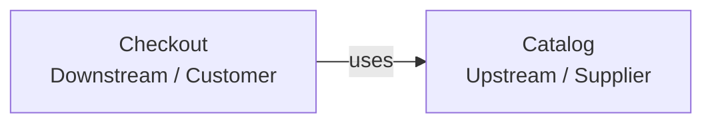
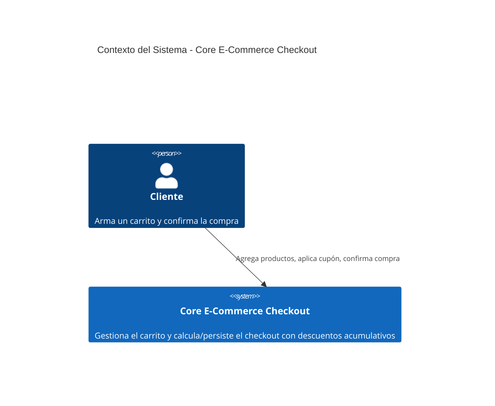
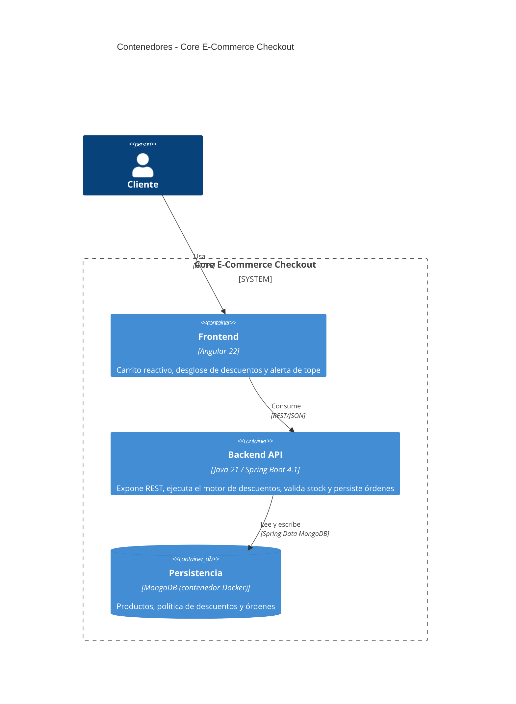
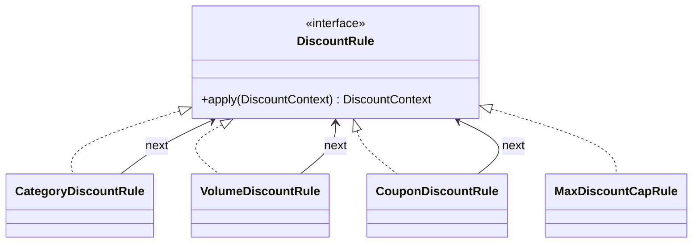
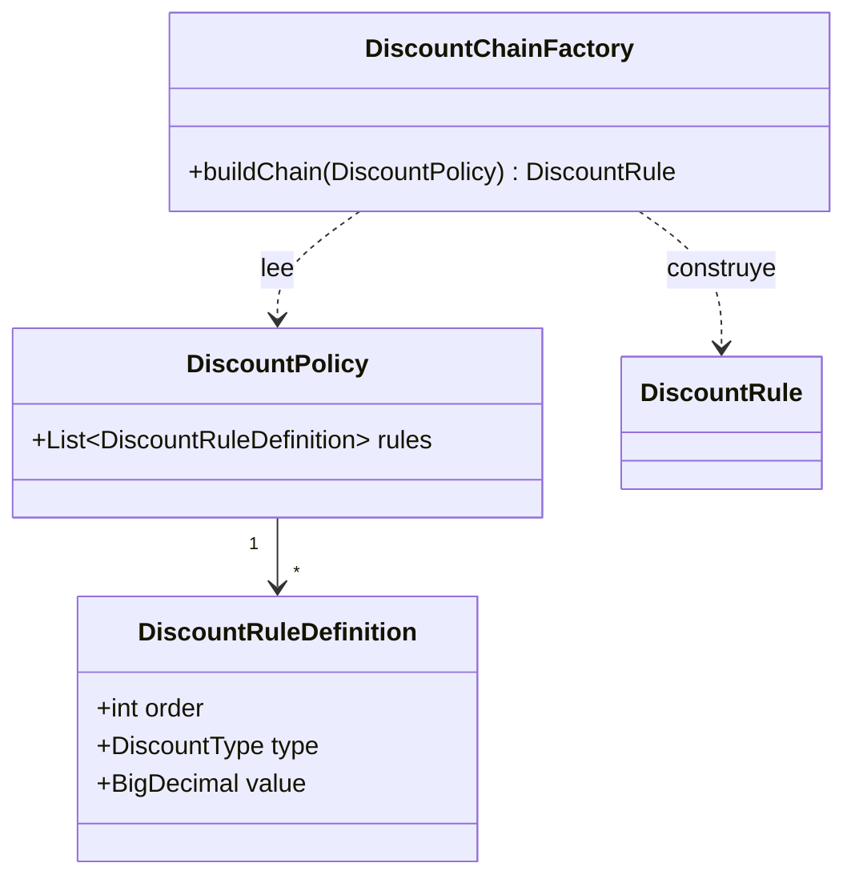

# Arquitectura: Core E-Commerce Checkout con Descuentos Acumulativos

> **Objetivo:** gestionar un carrito de compras y procesar el checkout aplicando un motor de descuentos acumulativos con reglas de precedencia y un tope máximo, garantizando consistencia entre el cálculo, el stock y la orden persistida.

## Índice

- **1. [Dominio (DDD)](#1-dominio-ddd)**
  - 1.1 [Subdominios](#11-subdominios)
  - 1.2 [Bounded Contexts](#12-bounded-contexts)
  - 1.3 [Context Map](#13-context-map)
  - 1.4 [Lenguaje ubicuo](#14-lenguaje-ubicuo)
  - 1.5 [Entidades](#15-entidades)
  - 1.6 [Aggregates](#16-aggregates)
  - 1.7 [Value Objects](#17-value-objects)
  - 1.8 [Invariantes](#18-invariantes)
  - 1.9 [Commands](#19-commands)
- **2. [Arquitectura externa](#2-arquitectura-externa)**
  - 2.1 [Visión general](#21-visión-general)
  - 2.2 [Backend](#22-backend)
  - 2.3 [Frontend](#23-frontend)
  - 2.4 [Selección de tecnologías](#24-selección-de-tecnologías)
  - 2.5 [Requerimientos no funcionales](#25-requerimientos-no-funcionales)
  - 2.6 [Modelo C4](#26-modelo-c4)
- **3. [Arquitectura interna](#3-arquitectura-interna)**
  - 3.1 [Backend](#31-backend)
  - 3.2 [Frontend](#32-frontend)
  - 3.3 [Persistencia](#33-persistencia)
- **4. [Trade-offs y decisiones arquitectónicas](#4-trade-offs-y-decisiones-arquitectónicas)**
  - 4.1 [Trade-offs](#41-trade-offs)
  - 4.2 [Registro de decisiones (ADR)](#42-registro-de-decisiones-adr)
- **5. [Consideraciones de Evolución Arquitectónica](#5-consideraciones-de-evolución-arquitectónica)**
  - 5.1 [Frontend](#51-frontend)
  - 5.2 [Backend](#52-backend)
  - 5.3 [Dominio](#53-dominio)

---

## 1. Dominio (DDD)

### 1.1 Subdominios

| Subdominio                         | Clasificación | Descripción                                                                                |
| :--------------------------------- | :------------ | :----------------------------------------------------------------------------------------- |
| **Proceso de Checkout (Order)**    | _Core_        | Validación de stock, orquestación de la compra y persistencia de la orden confirmada.      |
| **Motor de Descuentos (Discount)** | _Supporting_  | Cálculo secuencial de los descuentos acumulativos, con precedencia estricta y tope máximo. |
| **Catálogo (Catalog)**             | _Supporting_  | Consulta de productos y control del stock disponible.                                      |

El Proceso de Checkout es el subdominio _Core_: completar una compra de forma consistente es lo que el negocio necesita resolver. El Motor de Descuentos y el Catálogo son _Supporting_: existen para que el checkout pueda completarse (saber cuánto cobrar, saber qué hay disponible), pero ninguno de los dos es, por sí mismo, el objetivo del negocio. No existe un subdominio _Generic_: no hay capacidades como autenticación, procesamiento de pagos externos o notificaciones dentro del alcance funcional.

El sistema opera en modalidad monousuario: no existe gestión de usuarios, sesiones ni autenticación. El estado del carrito y el uso de cupones son globales a la aplicación, no están asociados a un cliente identificado — por eso ningún _Aggregate_ del modelo necesita una referencia a un usuario o una sesión.

### 1.2 Bounded Contexts

Se identifican dos _Bounded Contexts_:

- **Checkout**: agrupa los subdominios Proceso de Checkout (_Core_) y Motor de Descuentos (_Supporting_). Ambos comparten el mismo lenguaje (`Cart`, `Order`, `DiscountBreakdown`), el mismo ciclo de despliegue y no existe necesidad de un límite de contexto real entre ellos. Internamente se organizan como paquetes independientes (`order` y `discount`), de modo que la distinción _Core_/_Supporting_ quede reflejada en el código sin fragmentar el modelo en dos _Bounded Contexts_ separados.
- **Catalog**: lenguaje y reglas propias (`Product`, `Stock`, `Category`) independientes de las de Checkout.

### 1.3 Context Map

`Catalog` es el **_Upstream / Supplier_** porque es el Bounded Context responsable del catálogo de productos y del stock disponible. `Checkout` es el **_Downstream / Customer_** porque utiliza esas capacidades durante el proceso de compra para obtener la información necesaria y gestionar la disponibilidad de los productos.

La relación es **_Customer -> Supplier_** y se representa mediante `uses`, indicando que `Checkout` consume capacidades proporcionadas por `Catalog`. `Catalog` mantiene la autoridad sobre `Product` y `Stock`, mientras `Checkout` los utiliza como parte de la orquestación del checkout.



### 1.4 Lenguaje ubicuo

| Término             | Significado                                                                                                                                           |
| :------------------ | :---------------------------------------------------------------------------------------------------------------------------------------------------- |
| `Product`           | Ítem del catálogo con `id`, `name`, `description` (resumen mostrado en la interfaz), `unitPrice`, `category`, `stock`.                                |
| `Stock`             | Cantidad disponible de un producto para la venta.                                                                                                     |
| `Cart`              | Selección de productos y cantidades hecha por el cliente; es la entrada del cálculo de descuentos, sin identidad ni ciclo de vida persistente propio. |
| `DiscountPolicy`    | Configuración ordenada de las reglas de descuento vigentes.                                                                                           |
| `DiscountRule`      | Eslabón que aplica un tipo específico de descuento sobre el resultado acumulado.                                                                      |
| `Coupon`            | Código promocional de un solo uso: una vez aplicado en una compra confirmada, no puede volver a utilizarse.                                           |
| `Subtotal`          | Suma de los precios de los productos del carrito, antes de aplicar cualquier descuento.                                                               |
| `DiscountBreakdown` | Resultado del cálculo: montos por tipo de descuento, porcentaje efectivo, indicador de tope alcanzado y total a pagar.                                |
| `Total`             | Monto final a pagar, resultado de restar el descuento acumulado al subtotal.                                                                          |
| `Order`             | Compra confirmada, con sus líneas, el desglose de descuentos aplicado y el stock ya decrementado.                                                     |

### 1.5 Entidades

| Entidad                  | Tipo             | Pertenece a      | Descripción                                                                      |
| :----------------------- | :--------------- | :--------------- | :------------------------------------------------------------------------------- |
| `Product`                | _Aggregate Root_ | `Product`        | Ítem vendible, con stock que cambia en el tiempo.                                |
| `DiscountPolicy`         | _Aggregate Root_ | `DiscountPolicy` | Conjunto de reglas de descuento vigentes.                                        |
| `Order`                  | _Aggregate Root_ | `Order`          | Compra confirmada.                                                               |
| `Coupon`                 | Entidad interna  | `DiscountPolicy` | Código promocional, con estado de uso: activo o no, usado o no.                  |
| `OrderLine`              | Entidad interna  | `Order`          | Línea de producto dentro de una orden, con cantidad y precio unitario congelado. |
| `DiscountRuleDefinition` | Entidad interna  | `DiscountPolicy` | Definición de una regla de descuento configurada (orden, tipo, valor).           |

**Aclaraciones**

- `Cart` es una estructura de paso, vigente solo durante el cálculo que la usa; no se persiste como documento independiente.

### 1.6 Aggregates

| Aggregate          | Subdominio                         | Aggregate Root   | Responsabilidad                                                                                                     | Invariantes                                                                                                                                                                                                                                                                                                                                                                                        |
| :----------------- | :--------------------------------- | :--------------- | :------------------------------------------------------------------------------------------------------------------ | :------------------------------------------------------------------------------------------------------------------------------------------------------------------------------------------------------------------------------------------------------------------------------------------------------------------------------------------------------------------------------------------------- |
| **Product**        | Catálogo (_Supporting_)            | `Product`        | Representa el ítem vendible y su stock disponible.                                                                  | `stock ≥ 0`; `unitPrice > 0`.                                                                                                                                                                                                                                                                                                                                                                      |
| **DiscountPolicy** | Motor de Descuentos (_Supporting_) | `DiscountPolicy` | Agrupa el conjunto ordenado de reglas de descuento vigentes, incluido el `Coupon`, como una unidad de consistencia. | No existen dos reglas con el mismo `order`; cada regla tiene un `value` en `(0, 1]`, que representa el porcentaje de descuento; el conjunto cubre exactamente los tipos `CATEGORY`, `VOLUME`, `COUPON` y `CAP`; un `Coupon` solo puede aplicarse si `active = true` y `used = false`, y una vez aplicado en una compra confirmada, `used` pasa a `true` de forma permanente y no puede revertirse. |
| **Order**          | Proceso de Checkout (_Core_)       | `Order`          | Representa una compra confirmada, con su desglose de descuentos y el precio congelado por línea.                    | `total = subtotal − totalDiscountAmount`; `totalDiscountAmount ≤ 0.35 × subtotal`; toda `Order` tiene al menos una `OrderLine`; cada `OrderLine.quantity` fue validada contra el stock disponible al momento de su creación.                                                                                                                                                                       |

**Aclaraciones**

- `Coupon` se modela como entidad interna de `DiscountPolicy`, no como _Aggregate_ independiente: no hay ningún _Command_ que lo cree, active o desactive de forma aislada, y la razón original para separarlo (proteger su actualización contra escritura concurrente) no aplica en un sistema monousuario. Ver ADR-14.

### 1.7 Value Objects

| Value Object        | Descripción                                                                                                                                                         |
| :------------------ | :------------------------------------------------------------------------------------------------------------------------------------------------------------------ |
| `Money`             | Monto monetario, siempre no negativo. Evita que cualquier cálculo de precio o descuento use un número suelto sin esa garantía.                                      |
| `Percentage`        | Valor porcentual restringido al rango `[0,1]`. Evita que una tasa de descuento mal calculada (negativa o mayor a 1) llegue a representarse en el sistema.           |
| `CouponCode`        | Representa el código de un cupón (por ejemplo, `WELCOME2026`). Normaliza el valor ingresado (sin distinguir mayúsculas/minúsculas ni espacios) y valida su formato. |
| `DiscountBreakdown` | Resultado inmutable del cálculo de descuentos: los montos por tipo de descuento y el total resultante. Una vez calculado, no se modifica.                           |

**Aclaraciones**

- `Money`, `Percentage` y `CouponCode` se documentan aquí como conceptos del modelo, pero no se implementan como clases propias: sus reglas (monto no negativo, rango `[0,1]`, formato del código) se validan de forma declarativa sobre los DTOs de entrada, en el borde de la API. Esto implica que la garantía solo se verifica ahí — un valor fuera de rango producido en un cálculo intermedio dentro del dominio no pasa por ninguna validación. Ver ADR-17.

### 1.8 Invariantes

| Invariante                                         | Dónde se garantiza                                                                                                          |
| :------------------------------------------------- | :-------------------------------------------------------------------------------------------------------------------------- |
| `totalDiscountAmount ≤ 0.35 × subtotal`            | La regla de tope, último eslabón de la cadena de descuentos.                                                                |
| `total = subtotal − totalDiscountAmount`           | `Order` (_Aggregate Root_): no permite construirse con un total inconsistente.                                              |
| `stock ≥ 0` tras decremento                        | `Product` (_Aggregate Root_): rechaza cualquier decremento que deje el stock en negativo.                                   |
| Orden y unicidad de `DiscountRuleDefinition.order` | `DiscountPolicy` (_Aggregate Root_): no permite agregar una regla que repita un `order` ya existente.                       |
| Un `Coupon` usado no puede volver a aplicarse      | `DiscountPolicy` (_Aggregate Root_): ninguna operación posterior puede revertir el `used` de una de sus entidades `Coupon`. |

### 1.9 Commands

**Checkout**

- **CalculateCartDiscounts**: calcula el desglose de descuentos para el contenido actual del carrito, considerando opcionalmente un cupón, sin modificar el stock ni el estado de un cupón. Puede evaluarse en una simulación tantas veces como se quiera sin consumir el cupón.
- **PlaceOrder**: confirma la compra del contenido actual del carrito, considerando opcionalmente un cupón. Valida el stock, calcula los descuentos, decrementa el stock, marca el cupón aplicado como usado (si corresponde) y registra la orden. Es el único _Command_ que consume un cupón.
  **Catalog**

- **GetProducts**: consulta los productos disponibles con su stock, sin modificar estado.
- **DecrementStock**: reduce el stock de un producto en la cantidad solicitada; rechaza la operación si no hay stock suficiente. Es invocado por `PlaceOrder` a través de `ProductCatalogPort`.

---

## 2. Arquitectura externa

### 2.1 Visión general

El backend se organiza como un **monolito modular**: una única aplicación desplegable, dividida en los Bounded Contexts `checkout` (con los paquetes internos `discount` y `order`) y `catalog`, cada uno con la organización interna que su complejidad exige. La relación entre `checkout` y `catalog` sigue el `Customer/Supplier` definido en el _Context Map_ (ver Dominio): `checkout` consume las capacidades de `catalog`, sin acceder directamente a sus clases internas. El frontend es una unidad de despliegue independiente: se comunica con el backend exclusivamente por HTTP/REST, sin compartir proceso ni ciclo de despliegue con él.

### 2.2 Backend

Dos Bounded Contexts: `checkout`, dividido internamente en el paquete `order` (subdominio _Core_, orquestación de la compra, con arquitectura Hexagonal ligera) y el paquete `discount` (subdominio _Supporting_, motor de descuentos, en capas); y `catalog`, también en capas. La justificación de cada estilo arquitectónico y de la elección de monolito modular está en "Trade-offs y decisiones arquitectónicas".

### 2.3 Frontend

La aplicación Angular se organiza por Bounded Context: cada _Page_ de _Atomic Design_ corresponde a uno de los Bounded Contexts del dominio (`catalog`, `checkout`), sin acoplamiento cruzado más allá de interfaces bien definidas — el catálogo no necesita saber nada del carrito, y viceversa.

El renderizado se resuelve de forma híbrida: la carga inicial se ejecuta en el servidor para reducir el tiempo hasta la primera pintura, y la interacción del carrito se hidrata en el cliente una vez cargada la página. El detalle completo está en "Arquitectura interna".

### 2.4 Selección de tecnologías

- **Angular 22.** Integra TypeScript como su lenguaje estándar, con tipado fuerte de punta a punta y detección de errores de contrato en tiempo de compilación. Es un framework integral: enrutamiento, formularios, cliente HTTP, inyección de dependencias y animaciones vienen incluidos, sin depender de que el equipo integre librerías externas para cada pieza. Soporta de forma nativa el renderizado en servidor y la federación de módulos, por lo que la eventual evolución hacia microfrontends no requiere cambiar de framework ni introducir herramientas adicionales.
- **Java 21 / Spring Boot 4.1.x.** Spring Boot ofrece un ecosistema ya integrado para construir aplicaciones REST, seguras y desplegables en la nube (Spring Web, Spring Data, Spring Security, Spring Cloud), lo que evita ensamblar manualmente piezas sueltas para necesidades que la mayoría de backends terminan teniendo. Java aporta tipado fuerte y verificación en compilación. La migración futura hacia microservicios es de bajo costo dentro de este mismo ecosistema, y el lenguaje ofrece un modelo de concurrencia maduro y robusto, con buen rendimiento bajo alta carga de peticiones.
- **MongoDB (no relacional).** El checkout de este sistema tiene un patrón de acceso de lectura/escritura frecuente sobre documentos autocontenidos (una orden con sus líneas y su desglose de descuentos, un producto con su stock) y no requiere transacciones multi-tabla ni integridad referencial estricta entre entidades — a diferencia de un módulo de pagos real, donde la integridad transaccional es el requisito no negociable, aquí lo crítico es la velocidad de lectura/escritura y que cada documento sea internamente consistente. Un modelo documental resuelve eso de forma más directa que uno relacional, sin joins ni normalización, y cada `Aggregate` se persiste como una única unidad coherente con su propio límite de consistencia. Al ser un monolito modular, se usa una única base de datos MongoDB compartida por ambos Bounded Contexts (cada uno con sus propias colecciones), no una base de datos por módulo.

### 2.5 Requerimientos no funcionales

- **Calidad y seguridad del código.** El diseño sigue el principio de _Security by design_.
  - 100% de tipado fuerte en backend y frontend — cero usos de tipos dinámicos o genéricos sin justificación técnica explícita, verificable con una herramienta de análisis estático como SonarQube.
  - Contratos de entrada tipados mediante DTOs y validados de forma declarativa (Bean Validation en backend, formularios tipados en frontend), de modo que un dato inválido o mal formado se rechace antes de llegar a la lógica de dominio.
  - Un agente de _IA_ ejecuta las herramientas de análisis **SAST** (Static Application Security Testing), **SCA** (Software Composition Analysis) y _Secret Scanning_ antes de integrar cambios, sin vulnerabilidades críticas ni secretos expuestos sin remediar.
- **Testabilidad**, tanto en backend como en frontend.
  - Cobertura mínima del 80% en las capas lógicas esenciales (backend: motor de descuentos, validaciones de stock; frontend: estado del carrito, validación de la alerta de tope) como piso obligatorio, no como techo — el proyecto puede ampliar la cobertura a otras capas sin restricción.
  - Casos de borde obligatorios: el tope del 35% de descuento superado, carritos vacíos o con datos corruptos, cupones no registrados o expirados, e intentos de compra con stock insuficiente.

### 2.6 Modelo C4

**Contexto del sistema** — actores y sistema, sin sistemas externos dentro del alcance funcional actual.



**Contenedores** — frontend, backend y base de datos como las tres unidades desplegables del sistema; Mongo corre en su propio contenedor Docker, levantado como instancia de pruebas mediante el soporte de Docker Compose de Spring Boot.



---

## 3. Arquitectura interna

### 3.1 Backend

**Estructura de proyecto:**

```
kata-ecommerce-descuentos/backend/
└── src/main/java/com/ribolost/pruebastecnicas/kataecommerce/
    ├── catalog/
    │   ├── domain/
    │   │   └── Product.java
    │   ├── application/
    │   │   └── ProductService.java
    │   └── infrastructure/
    │       ├── controller/
    │       │   └── ProductController.java
    │       └── repository/
    │           ├── ProductRepository.java
    │           └── ProductDocument.java
    │
    ├── checkout/
    │   ├── discount/                              (subdominio Supporting — capas con nomenclatura de Hexagonal)
    │   │   ├── domain/
    │   │   │   ├── DiscountPolicy.java
    │   │   │   ├── DiscountRuleDefinition.java
    │   │   │   ├── DiscountBreakdown.java
    │   │   │   ├── DiscountContext.java
    │   │   │   ├── Coupon.java                    (entidad interna de DiscountPolicy)
    │   │   │   └── rules/
    │   │   │       ├── DiscountRule.java
    │   │   │       ├── CategoryDiscountRule.java
    │   │   │       ├── VolumeDiscountRule.java
    │   │   │       ├── CouponDiscountRule.java
    │   │   │       ├── MaxDiscountCapRule.java
    │   │   │       └── DiscountChainFactory.java
    │   │   ├── application/
    │   │   │   └── DiscountService.java
    │   │   └── infrastructure/
    │   │       └── repository/
    │   │           ├── DiscountPolicyRepository.java
    │   │           └── DiscountPolicyDocument.java  (Coupon embebido dentro del documento)
    │   │
    │   └── order/                                 (subdominio Core — Hexagonal completa)
    │       ├── domain/
    │       │   ├── Order.java
    │       │   └── OrderLine.java
    │       ├── application/
    │       │   ├── PlaceOrderService.java
    │       │   ├── CalculateCartDiscountsService.java
    │       │   ├── port/
    │       │   │   ├── in/
    │       │   │   │   ├── PlaceOrderUseCase.java
    │       │   │   │   └── CalculateCartDiscountsUseCase.java
    │       │   │   └── out/
    │       │   │       ├── OrderRepository.java
    │       │   │       ├── ProductStockPort.java
    │       │   │       └── DiscountCalculationPort.java
    │       │   ├── dto/
    │       │   │   ├── in/
    │       │   │   │   ├── CartItemRequest.java
    │       │   │   │   └── CartRequest.java
    │       │   │   └── out/
    │       │   │       ├── OrderLineResponse.java
    │       │   │       ├── DiscountBreakdownResponse.java
    │       │   │       └── OrderConfirmationResponse.java
    │       │   └── validation/
    │       │       ├── ValidCouponCode.java
    │       │       └── CouponCodeFormatValidator.java
    │       └── infrastructure/
    │           ├── adapter/
    │           │   ├── in/web/
    │           │   │   └── CheckoutController.java
    │           │   └── out/
    │           │       ├── OrderRepositoryAdapter.java
    │           │       ├── CatalogStockAdapter.java
    │           │       └── DiscountCalculationAdapter.java
    │           └── persistence/
    │               ├── OrderDocument.java
    │               └── OrderLineDocument.java
    │
    └── shared/
        └── error/
            ├── BusinessException.java
            ├── InsufficientStockException.java
            ├── EmptyCartException.java
            ├── InvalidCartItemException.java
            └── GlobalExceptionHandler.java
```

**Módulo `catalog`.** Expone el listado de productos con su stock y permite que `checkout` consulte y decremente stock de forma controlada. No conoce nada sobre descuentos ni órdenes.

**Módulo `discount`.** No consulta `catalog` por su cuenta: `DiscountService` ejecuta la cadena sobre los datos que `order` ya le resolvió. No tiene controlador propio — su caso de uso se expone a través de `CheckoutController`, en `order`.

**Módulo `order`.** `OrderRepositoryAdapter` implementa `OrderRepository` contra MongoDB; `CatalogStockAdapter` implementa `ProductStockPort` invocando en proceso al `ProductService` de `catalog`, con una operación por lote (evita N+1, ver RN-10); `DiscountCalculationAdapter` implementa `DiscountCalculationPort` invocando al `DiscountService` de `discount`. `CheckoutController` expone `/cart/calculate` (`CalculateCartDiscountsUseCase`) y `/checkout` (`PlaceOrderUseCase`).

**Patrones de diseño del motor de descuentos.**

Cadena de reglas de descuento (Chain of Responsibility):



Construcción de la cadena a partir de la configuración (Factory):



**Reglas de negocio.** Cada regla indica su condición de activación, su efecto, un criterio de aceptación con ejemplo numérico, y a qué caso de prueba obligatorio corresponde (los exigidos explícitamente para el motor de descuentos y las validaciones de stock).

| #     | Regla                                                        | Condición                                                                                                                                                                     | Efecto                                                                                                                                                                                                                                                                                                                                                                             | Criterio de aceptación (ejemplo)                                                                                  | Caso de prueba obligatorio                                           |
| :---- | :----------------------------------------------------------- | :---------------------------------------------------------------------------------------------------------------------------------------------------------------------------- | :--------------------------------------------------------------------------------------------------------------------------------------------------------------------------------------------------------------------------------------------------------------------------------------------------------------------------------------------------------------------------------- | :---------------------------------------------------------------------------------------------------------------- | :------------------------------------------------------------------- |
| RN-01 | Descuento de categoría                                       | El carrito contiene al menos un producto de categoría "Tecnología"                                                                                                            | 10% sobre el precio de esos productos específicos                                                                                                                                                                                                                                                                                                                                  | Producto Tecnología de $50 → descuento de categoría = $5                                                          | Regla base del motor de descuentos                                   |
| RN-02 | Descuento por volumen                                        | El subtotal acumulado hasta ese punto de la cadena supera $100 USD                                                                                                            | 5% adicional sobre el total acumulado                                                                                                                                                                                                                                                                                                                                              | Subtotal acumulado $120 (tras RN-01) → descuento de volumen = $6                                                  | Regla base del motor de descuentos                                   |
| RN-03 | Descuento por cupón                                          | Se ingresó un código y corresponde a un `Coupon` activo y no usado                                                                                                            | 15% adicional sobre el total acumulado                                                                                                                                                                                                                                                                                                                                             | `WELCOME2026` válido sobre subtotal acumulado $150 → descuento de cupón = $22.50                                  | Regla base del motor de descuentos                                   |
| RN-04 | Tope de descuento                                            | Siempre se evalúa, como último eslabón de la cadena                                                                                                                           | El descuento acumulado (RN-01 a RN-03) nunca supera 35% del subtotal original; si lo excede, se trunca exactamente en 35%                                                                                                                                                                                                                                                          | Subtotal $200; RN-01+RN-02+RN-03 calculan 40% ($80) → se trunca a 35% ($70); total a pagar $130                   | **Tope del 35% de descuento superado**                               |
| RN-05 | Cupón inválido, inactivo o ya usado                          | El código no existe, está inactivo o `used = true`                                                                                                                            | RN-03 no se aplica; las demás reglas se calculan igual; la compra puede confirmarse                                                                                                                                                                                                                                                                                                | Código `EXPIRED2024` inexistente → checkout se confirma sin el 15%, con RN-01 y RN-02 aplicados                   | **Cupón no registrado o expirado**                                   |
| RN-06 | Validación de stock                                          | Ocurre únicamente en `PlaceOrder` (`/checkout`); nunca en `CalculateCartDiscounts` (`/cart/calculate`)                                                                        | Si alguna línea no tiene stock suficiente, se rechaza toda la operación (`409`) antes de calcular o persistir cualquier dato                                                                                                                                                                                                                                                       | Carrito pide 2 unidades de un producto con stock 1 → `409` antes de cualquier cálculo                             | **Intento de compra con stock insuficiente**                         |
| RN-07 | Consumo de cupón                                             | Solo ocurre al confirmar la compra (`PlaceOrder`)                                                                                                                             | `Coupon.used` pasa a `true` de forma permanente, dentro de `DiscountPolicy`                                                                                                                                                                                                                                                                                                        | `WELCOME2026` aplicado en un `PlaceOrder` exitoso → un segundo intento con el mismo código se comporta como RN-05 | Regla base del motor de descuentos                                   |
| RN-08 | Carrito vacío o inválido                                     | El carrito no tiene líneas, o una línea referencia un producto inexistente o cantidad ≤ 0                                                                                     | Se rechaza con `400` antes de cualquier cálculo, en ambas operaciones                                                                                                                                                                                                                                                                                                              | `items: []` → `400` tanto en `/cart/calculate` como en `/checkout`                                                | **Carrito vacío o con datos corruptos**                              |
| RN-09 | Formato de cupón inválido                                    | El código no cumple el formato esperado (`@ValidCouponCode`, evaluado sobre `CartRequest`)                                                                                    | Se rechaza con `400` en el borde de la API, antes de llegar a cualquier caso de uso                                                                                                                                                                                                                                                                                                | Código `"ab"` → `400` sin llegar a `CalculateCartDiscountsService` ni `PlaceOrderService`                         | **Cupón no registrado o expirado** (variante de formato)             |
| RN-10 | Consulta de stock por lote                                   | Validación de stock de las líneas de un carrito con más de un producto                                                                                                        | `ProductStockPort` recibe todas las líneas en una sola llamada; nunca una consulta por producto (evita N+1)                                                                                                                                                                                                                                                                        | Carrito con 5 líneas → 1 llamada a `ProductStockPort`, no 5                                                       | Requisito técnico que soporta RN-06                                  |
| RN-11 | Orden de ejecución y consistencia dentro de una misma sesión | `PlaceOrder` ejecuta: validar stock → calcular descuentos → persistir la orden → decrementar stock, en ese orden, sin una transacción multi-documento que una las dos últimas | Si `decrementStock` falla (error de validación, timeout de Mongo, excepción no prevista) sin que el proceso se reinicie, la orden queda registrada con el stock sin descontar, y esa inconsistencia es visible mientras la aplicación siga corriendo. No aplica si el proceso se reinicia: al no haber persistencia real entre reinicios, ese escenario vuelve a los datos semilla | Ver ADR-18 para la limitación técnica de MongoDB y el camino de resolución futura                                 | Riesgo conocido, no cubierto por prueba automatizada en este alcance |

**Manejo de errores.** `BusinessException` como raíz de las excepciones de negocio (`InsufficientStockException`, `EmptyCartException`, `InvalidCartItemException`), separadas de las excepciones técnicas. El tope de descuento del 35% no es una excepción (RN-04). `GlobalExceptionHandler` centraliza la traducción de excepciones de negocio y de errores de validación (`@ValidCouponCode`, Bean Validation sobre `CartRequest`) a respuestas HTTP tipadas; las excepciones no previstas se registran en el servidor y devuelven una respuesta genérica, sin exponer detalles internos.
