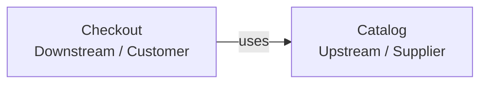
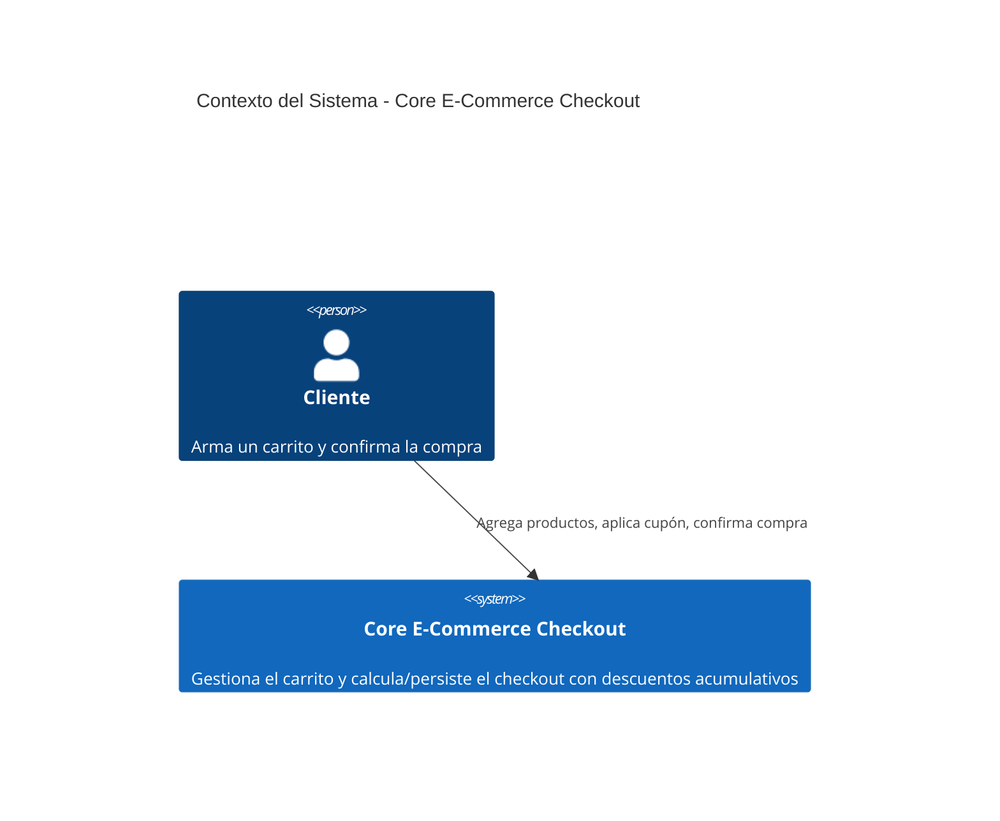
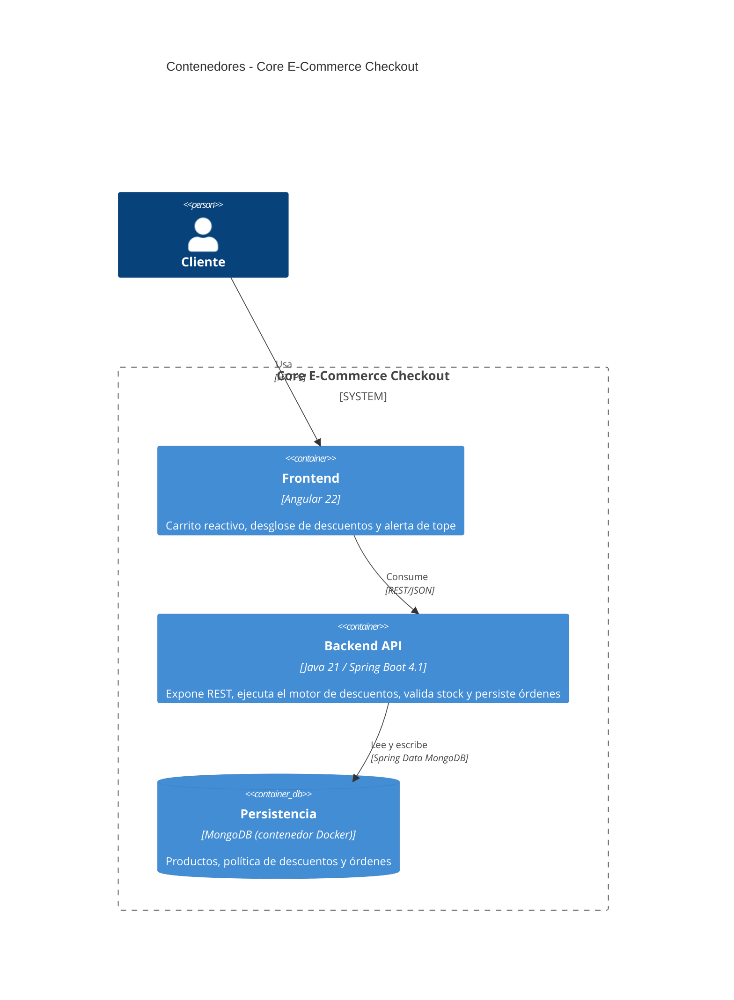
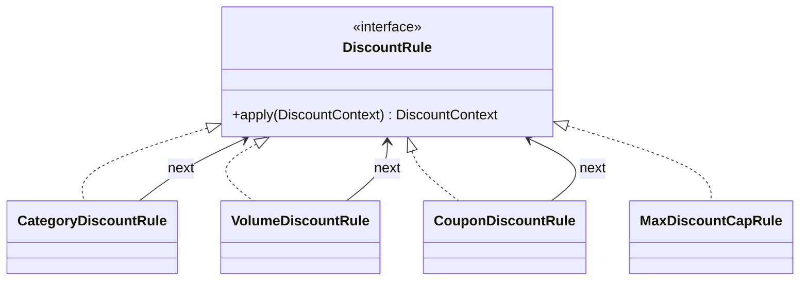
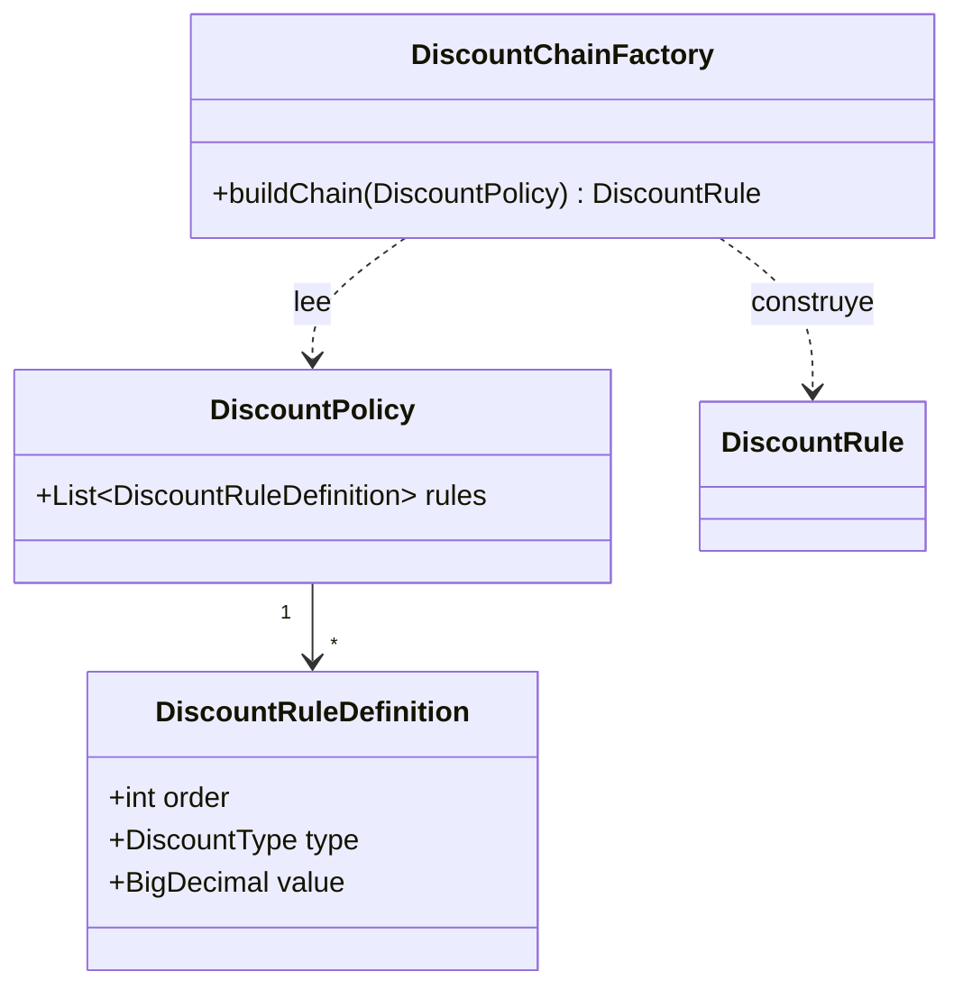
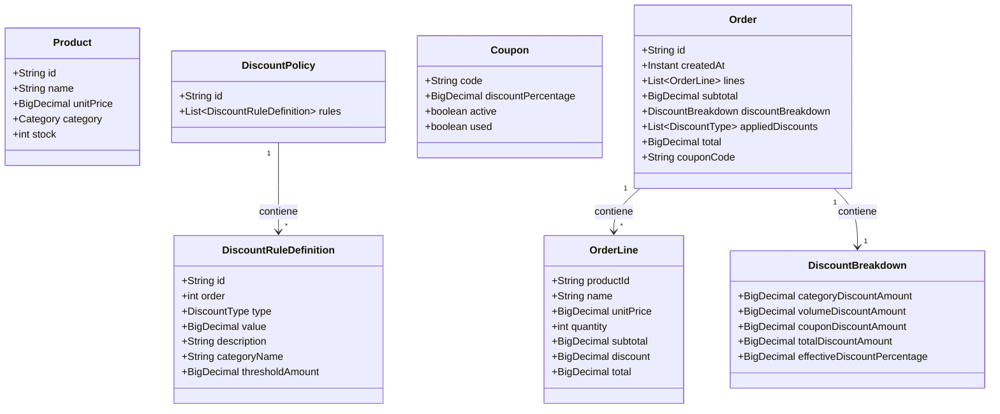

# Arquitectura: _Core_ _E-Commerce_ _Checkout_ con Descuentos Acumulativos

> **Objetivo:** gestionar un carrito de compras y procesar el _checkout_ aplicando un motor de descuentos acumulativos con reglas de precedencia y un tope máximo, validando el _stock_ antes de confirmar la compra y documentando el riesgo de consistencia entre los documentos involucrados.

## Índice

- **1. [Dominio (DDD)](#1-dominio-ddd)**
  - 1.1 [Subdominios](#11-subdominios)
  - 1.2 [_Bounded_ _Contexts_](#12-bounded-contexts)
  - 1.3 [\*_Context_ _Map_\*](#13-context-map)
  - 1.4 [Lenguaje ubicuo](#14-lenguaje-ubicuo)
  - 1.5 [Entidades](#15-entidades)
  - 1.6 [_Aggregates_](#16-aggregates)
  - 1.7 [**Value\* \*Objects**](#17-value-objects)
  - 1.8 [Invariantes](#18-invariantes)
  - 1.9 [_Commands_](#19-commands)
- **2. [Arquitectura externa](#2-arquitectura-externa)**
  - 2.1 [Visión general](#21-visión-general)
  - 2.2 [_Backend_](#22-backend)
  - 2.3 [_Frontend_](#23-frontend)
  - 2.4 [Selección de tecnologías](#24-selección-de-tecnologías)
  - 2.5 [Requerimientos no funcionales](#25-requerimientos-no-funcionales)
  - 2.6 [Modelo C4](#26-modelo-c4)
- **3. [Arquitectura interna](#3-arquitectura-interna)**
  - 3.1 [_Backend_](#31-backend)
  - 3.2 [_Frontend_](#32-frontend)
  - 3.3 [Persistencia](#33-persistencia)
- **4. [_*Trade-offs* y decisiones arquitectónicas_](#4-trade-offs-y-decisiones-arquitectónicas)**
  - 4.1 [_Trade-offs_](#41-trade-offs)
  - 4.2 [Registro de decisiones (ADR)](#42-registro-de-decisiones-adr)
- **5. [Consideraciones de Evolución Arquitectónica](#5-consideraciones-de-evolución-arquitectónica)**
  - 5.1 [_Frontend_](#51-frontend)
  - 5.2 [_Backend_](#52-backend)
  - 5.3 [Dominio](#53-dominio)

---

## 1. Dominio (DDD)

### 1.1 Subdominios

| Subdominio                           | Clasificación | Descripción                                                                                |
| :----------------------------------- | :------------ | :----------------------------------------------------------------------------------------- |
| **Proceso de _Checkout_ (_Order_)**  | _Core_        | Validación de _stock_, orquestación de la compra y persistencia de la orden confirmada.    |
| **Motor de Descuentos (_Discount_)** | _Supporting_  | Cálculo secuencial de los descuentos acumulativos, con precedencia estricta y tope máximo. |
| **Catálogo (_Catalog_)**             | _Supporting_  | Consulta de productos y control del _stock_ disponible.                                    |

El Proceso de _Checkout_ es el subdominio _Core_: completar una compra de forma consistente es lo que el negocio necesita resolver. El Motor de Descuentos y el Catálogo son _Supporting_: existen para que el _checkout_ pueda completarse (saber cuánto cobrar, saber qué hay disponible), pero ninguno de los dos es, por sí mismo, el objetivo del negocio. No existe un subdominio _Generic_: no hay capacidades como autenticación, procesamiento de pagos externos o notificaciones dentro del alcance funcional.

El sistema opera en modalidad monousuario: no existe gestión de usuarios, sesiones ni autenticación. El estado del carrito y el uso de cupones son globales a la aplicación, no están asociados a un cliente identificado — por eso ningún _Aggregate_ del modelo necesita una referencia a un usuario o una sesión.

### 1.2 _Bounded_ _Contexts_

Se identifican dos _Bounded Contexts_:

- **_Checkout_**: agrupa los subdominios Proceso de _Checkout_ (_Core_) y Motor de Descuentos (_Supporting_). Ambos comparten el mismo lenguaje (`Cart`, `Order`, `DiscountBreakdown`), el mismo ciclo de despliegue y no existe necesidad de un límite de contexto real entre ellos. Internamente se organizan como paquetes independientes (`order` y `discount`), de modo que la distinción _Core_/_Supporting_ quede reflejada en el código sin fragmentar el modelo en dos _Bounded Contexts_ separados.
- **_Catalog_**: lenguaje y reglas propias (`Product`, `Stock`, `Category`) independientes de las de _Checkout_.

### 1.3 \*_Context_ _Map_\*

`Catalog` es el **_Upstream / Supplier_** porque es el _Bounded_ _Context_ responsable del catálogo de productos y del _stock_ disponible. `Checkout` es el **_Downstream / Customer_** porque utiliza esas capacidades durante el proceso de compra para obtener la información necesaria y gestionar la disponibilidad de los productos.

La relación es **_Customer -> Supplier_** y se representa mediante `uses`, indicando que `Checkout` consume capacidades proporcionadas por `Catalog`. `Catalog` mantiene la autoridad sobre `Product` y `Stock`, mientras `Checkout` los utiliza como parte de la orquestación del _checkout_.



### 1.4 Lenguaje ubicuo

| Término             | Significado                                                                                                                                           |
| :------------------ | :---------------------------------------------------------------------------------------------------------------------------------------------------- |
| `Product`           | Ítem del catálogo con `id`, `name`, `description` (resumen mostrado en la interfaz), `unitPrice`, `category`, `stock`.                                |
| `Stock`             | Cantidad disponible de un producto para la venta.                                                                                                     |
| `Cart`              | Selección de productos y cantidades hecha por el cliente; es la entrada del cálculo de descuentos, sin identidad ni ciclo de vida persistente propio. |
| `DiscountPolicy`    | Configuración ordenada de las reglas de descuento vigentes.                                                                                           |
| `DiscountRule`      | Eslabón que aplica un tipo específico de descuento sobre el resultado acumulado.                                                                      |
| `Coupon`            | Código promocional de un solo uso: una vez aplicado en una compra confirmada, no puede volver a utilizarse.                                           |
| `Subtotal`          | Suma de los precios de los productos del carrito, antes de aplicar cualquier descuento.                                                               |
| `DiscountBreakdown` | Resultado del cálculo: montos por tipo de descuento, porcentaje efectivo, descuento total y total a pagar.                                            |
| `Total`             | Monto final a pagar, resultado de restar el descuento acumulado al _subtotal_.                                                                        |
| `Order`             | Compra confirmada, con sus líneas, el desglose de descuentos aplicado y el _stock_ ya decrementado.                                                   |

### 1.5 Entidades

| Entidad                  | Tipo             | Pertenece a      | Descripción                                                                      |
| :----------------------- | :--------------- | :--------------- | :------------------------------------------------------------------------------- |
| `Product`                | _Aggregate Root_ | `Product`        | Ítem vendible, con _stock_ que cambia en el tiempo.                              |
| `DiscountPolicy`         | _Aggregate Root_ | `DiscountPolicy` | Conjunto de reglas de descuento vigentes.                                        |
| `Order`                  | _Aggregate Root_ | `Order`          | Compra confirmada.                                                               |
| `Coupon`                 | Entidad interna  | `DiscountPolicy` | Código promocional, con estado de uso: activo o no, usado o no.                  |
| `OrderLine`              | Entidad interna  | `Order`          | Línea de producto dentro de una orden, con cantidad y precio unitario congelado. |
| `DiscountRuleDefinition` | Entidad interna  | `DiscountPolicy` | Definición de una regla de descuento configurada (orden, tipo, valor).           |

**Aclaraciones**

- `Cart` es una estructura de paso, vigente solo durante el cálculo que la usa; no se persiste como documento independiente.

### 1.6 _Aggregates_

| _Aggregate_        | Subdominio                         | \*_Aggregate_ _Root_\* | Responsabilidad                                                                                                     | Invariantes                                                                                                                                                                                                                                                                                                                                                                                          |
| :----------------- | :--------------------------------- | :--------------------- | :------------------------------------------------------------------------------------------------------------------ | :--------------------------------------------------------------------------------------------------------------------------------------------------------------------------------------------------------------------------------------------------------------------------------------------------------------------------------------------------------------------------------------------------- |
| **_Product_**      | Catálogo (_Supporting_)            | `Product`              | Representa el ítem vendible y su _stock_ disponible.                                                                | `stock ≥ 0`; `unitPrice > 0`.                                                                                                                                                                                                                                                                                                                                                                        |
| **DiscountPolicy** | Motor de Descuentos (_Supporting_) | `DiscountPolicy`       | Agrupa el conjunto ordenado de reglas de descuento vigentes, incluido el `Coupon`, como una unidad de consistencia. | No existen dos reglas con el mismo `order`; cada regla tiene un `value` en `(0, 1]`, que representa el porcentaje de descuento; el conjunto cubre exactamente los tipos `CATEGORY`, `VOLUME`, `COUPON` y `TOTAL`; un `Coupon` solo puede aplicarse si `active = true` y `used = false`, y una vez aplicado en una compra confirmada, `used` pasa a `true` de forma permanente y no puede revertirse. |
| **_Order_**        | Proceso de _Checkout_ (_Core_)     | `Order`                | Representa una compra confirmada, con su desglose de descuentos y el precio congelado por línea.                    | `total = subtotal − totalDiscountAmount`; `totalDiscountAmount ≤ 0.35 × subtotal`; toda `Order` tiene al menos una `OrderLine`; cada `OrderLine.quantity` fue validada contra el _stock_ disponible al momento de su creación.                                                                                                                                                                       |

**Aclaraciones**

- `Coupon` se modela como entidad interna de `DiscountPolicy`, no como _Aggregate_ independiente: no hay ningún _Command_ que lo cree, active o desactive de forma aislada, y la razón original para separarlo (proteger su actualización contra escritura concurrente) no aplica en un sistema monousuario. Ver ADR-14.

### 1.7 Conceptos de valor

| Concepto            | Descripción                                                                                                                                                         |
| :------------------ | :------------------------------------------------------------------------------------------------------------------------------------------------------------------ |
| `Money`             | Monto monetario, siempre no negativo. Evita que cualquier cálculo de precio o descuento use un número suelto sin esa garantía.                                      |
| `Percentage`        | Valor porcentual restringido al rango `[0,1]`. Evita que una tasa de descuento mal calculada (negativa o mayor a 1) llegue a representarse en el sistema.           |
| `CouponCode`        | Representa el código de un cupón (por ejemplo, `WELCOME2026`). Normaliza el valor ingresado (sin distinguir mayúsculas/minúsculas ni espacios) y valida su formato. |
| `DiscountBreakdown` | Resultado inmutable del cálculo de descuentos: los montos por tipo de descuento y el total resultante. Una vez calculado, no se modifica.                           |

**Aclaraciones**

- `Money`, `Percentage` y `CouponCode` se documentan aquí como conceptos de valor del dominio. En la implementación no se materializan como clases propias; sus reglas (monto no negativo, rango `[0,1]`, formato del código) se validan de forma declarativa sobre los _DTOs_ de entrada, en el borde de la _API_. Esto implica que la garantía solo se verifica ahí — un valor fuera de rango producido en un cálculo intermedio dentro del dominio no pasa por ninguna validación. Ver ADR-17.

### 1.8 Invariantes

| Invariante                                         | Dónde se garantiza                                                                                                          |
| :------------------------------------------------- | :-------------------------------------------------------------------------------------------------------------------------- |
| `totalDiscountAmount ≤ 0.35 × subtotal`            | La regla de tope, último eslabón de la cadena de descuentos.                                                                |
| `total = subtotal − totalDiscountAmount`           | `Order` (_Aggregate Root_): no permite construirse con un total inconsistente.                                              |
| `stock ≥ 0` tras decremento                        | `Product` (_Aggregate Root_): rechaza cualquier decremento que deje el _stock_ en negativo.                                 |
| Orden y unicidad de `DiscountRuleDefinition.order` | `DiscountPolicy` (_Aggregate Root_): no permite agregar una regla que repita un `order` ya existente.                       |
| Un `Coupon` usado no puede volver a aplicarse      | `DiscountPolicy` (_Aggregate Root_): ninguna operación posterior puede revertir el `used` de una de sus entidades `Coupon`. |

### 1.9 _Commands_

**_Discount_**

- **CalculateDiscounts**: calcula el desglose de descuentos para el contenido actual del carrito, considerando opcionalmente un cupón, sin modificar el _stock_ ni el estado de un cupón. Puede evaluarse tantas veces como sea necesario sin consumir el cupón.

**_Order_**

- **PlaceOrder**: confirma la compra del contenido actual del carrito, considerando opcionalmente un cupón. Valida el _stock_, calcula los descuentos, decrementa el _stock_, marca el cupón aplicado como usado (si corresponde) y registra la orden. Es el único _Command_ que consume un cupón.

**_Catalog_**

- **GetProducts**: consulta los productos disponibles con su _stock_, sin modificar estado.
- **DecrementStock**: reduce el _stock_ de un producto en la cantidad solicitada; rechaza la operación si no hay _stock_ suficiente. Es invocado por `PlaceOrder` a través de `ProductCatalogPort`.

---

## 2. Arquitectura externa

### 2.1 Visión general

El _backend_ se organiza como un **monolito _modular_**: una única aplicación desplegable, dividida en los _Bounded_ _Contexts_ `checkout` (con los paquetes internos `discount` y `order`) y `catalog`, cada uno con la organización interna que su complejidad exige. La relación entre `checkout` y `catalog` sigue el `Customer/Supplier` definido en el _Context Map_ (ver Dominio): `checkout` consume las capacidades de `catalog`, sin acceder directamente a sus clases internas. El _frontend_ es una unidad de despliegue independiente: se comunica con el _backend_ exclusivamente por _HTTP_/_REST_, sin compartir proceso ni ciclo de despliegue con él.

### 2.2 _Backend_

Dos _Bounded_ _Contexts_: `checkout`, dividido internamente en el paquete `order` (subdominio _Core_, orquestación de la compra, con arquitectura Hexagonal ligera) y el paquete `discount` (subdominio _Supporting_, motor de descuentos, en capas); y `catalog`, también en capas. La justificación de cada estilo arquitectónico y de la elección de monolito _modular_ está en "\*_Trade-offs_ y decisiones arquitectónicas\*".

### 2.3 _Frontend_

La aplicación _Angular_ se organiza por _features_ alineadas con los _Bounded_ _Contexts_ del dominio (`catalog`, `checkout`). _Atomic Design_ define la composición y reutilización de la interfaz dentro de esas _features_, mientras que los _Bounded Contexts_ delimitan las responsabilidades del dominio. Las _Pages_ pertenecen a su _feature_ correspondiente y consumen los componentes reutilizables definidos en `shared/ui`. Además, contiene un _sidebar_ en donde se encuentra el carrito de compras.

El renderizado se resuelve de forma híbrida: la carga inicial se ejecuta en el servidor para reducir el tiempo hasta la primera pintura, y la interacción del carrito se hidrata en el cliente una vez cargada la página. El detalle completo está en [Arquitectura interna](#32-frontend).

### 2.4 Selección de tecnologías

- **_Angular_ 22.** Integra _TypeScript_ como su lenguaje estándar, con tipado fuerte de punta a punta y detección de errores de contrato en tiempo de compilación. Es un _framework_ integral: enrutamiento, formularios, cliente _HTTP_, inyección de dependencias y animaciones vienen incluidos, sin depender de que el equipo integre librerías externas para cada pieza. Soporta de forma nativa el renderizado en servidor y la federación de módulos, por lo que la estructura actual permite evolucionar sin cambiar de _framework_ ni introducir herramientas adicionales.
- **Java 21 / Spring Boot 4.1.x.** Spring Boot ofrece un ecosistema ya integrado para construir aplicaciones _REST_, seguras y desplegables en la nube (Spring Web, Spring Data, Spring _Security_, Spring Cloud), lo que evita ensamblar manualmente piezas sueltas para necesidades que la mayoría de backends terminan teniendo. Java aporta tipado fuerte y verificación en compilación. El lenguaje ofrece un modelo de concurrencia maduro y robusto, con buen rendimiento bajo alta carga de peticiones.
- **_MongoDB_ (no relacional).** El _checkout_ de este sistema tiene un patrón de acceso de lectura/escritura frecuente sobre documentos autocontenidos (una orden con sus líneas y su desglose de descuentos, un producto con su _stock_) y no requiere transacciones multi-tabla ni integridad referencial estricta entre entidades — a diferencia de un módulo de pagos real, donde la integridad transaccional es el requisito no negociable, aquí lo crítico es la velocidad de lectura/escritura y que cada documento sea internamente consistente. Un modelo documental resuelve eso de forma más directa que uno relacional, sin _joins_ ni normalización, y cada `Aggregate` se persiste como una única unidad coherente con su propio límite de consistencia. Al ser un monolito _modular_, se usa una única base de datos _MongoDB_ compartida por ambos _Bounded_ _Contexts_ (cada uno con sus propias colecciones), no una base de datos por módulo.

### 2.5 Requerimientos no funcionales

- **Calidad y seguridad del código.** El diseño sigue el principio de _Security by design_.
  - 100% de tipado fuerte en _backend_ y _frontend_ — cero usos de tipos dinámicos o genéricos sin justificación técnica explícita, verificable con una herramienta de análisis estático como _SonarQube_.
  - Contratos de entrada tipados mediante _DTOs_ y validados de forma declarativa (_Bean_ _Validation_ en _backend_, formularios tipados en _frontend_), de modo que un dato inválido o mal formado se rechace antes de llegar a la lógica de dominio.
  - El _backend_ no confía en totales, descuentos ni estados calculados por el _frontend_; recalcula y valida los datos relevantes en el punto de confirmación. Las operaciones de decremento de _stock_ solo pueden ejecutarse dentro del flujo de compra y no se exponen como una operación arbitraria. Las respuestas de error no exponen detalles internos de implementación y las dependencias se mantienen bajo controles de análisis de seguridad.
  - Un agente de _IA_ ejecuta las herramientas de análisis **SAST** (Static _Application_ _Security_ _Testing_), **SCA** (Software Composition Analysis) y _Secret Scanning_ antes de integrar cambios, sin vulnerabilidades críticas ni secretos expuestos sin remediar.
- **Testabilidad**, tanto en _backend_ como en _frontend_.
  - Cobertura mínima del 80% en las capas lógicas esenciales (_backend_: motor de descuentos, validaciones de _stock_; _frontend_: estado del carrito, validación de la alerta de tope) como piso obligatorio (no representa el máximo) — el proyecto puede ampliar la cobertura a otras capas sin restricción.
  - Casos de borde obligatorios: el tope del 35% de descuento superado, carritos vacíos o con datos corruptos, cupones no registrados o expirados, e intentos de compra con _stock_ insuficiente.

### 2.6 Modelo C4

**Contexto del sistema** — actores y sistema, sin sistemas externos dentro del alcance funcional actual.



**Contenedores** — _frontend_, _backend_ y base de datos como las tres unidades desplegables del sistema; Mongo corre en su propio contenedor Docker, levantado como instancia de pruebas mediante el soporte de Docker Compose de Spring Boot.



---

## 3. Arquitectura interna

### 3.1 _Backend_

**Estructura de proyecto:**

```
kata-ecommerce-descuentos/backend/
└── src/main/java/com/ribolost/pruebastecnicas/kataecommerce/
    ├── catalog/
    │   ├── domain/
    │   │   └── Product.java
    │   ├── application/
    │   │   └── ProductService.java
    │   └── infrastructure/
    │       ├── controller/
    │       │   └── ProductController.java
    │       └── repository/
    │           ├── ProductRepository.java
    │           └── ProductDocument.java
    │
    ├── checkout/
    │   ├── discount/
    │   │   ├── domain/
    │   │   │   ├── DiscountPolicy.java
    │   │   │   ├── DiscountRuleDefinition.java
    │   │   │   ├── DiscountBreakdown.java
    │   │   │   ├── DiscountContext.java
    │   │   │   ├── Coupon.java
    │   │   │   └── rules/
    │   │   │       ├── DiscountRule.java
    │   │   │       ├── CategoryDiscountRule.java
    │   │   │       ├── VolumeDiscountRule.java
    │   │   │       ├── CouponDiscountRule.java
    │   │   │       ├── MaxDiscountCapRule.java
    │   │   │       └── DiscountChainFactory.java
    │   │   ├── application/
    │   │   │   ├── DiscountService.java
    │   │   │   └── dto/
    │   │   │       ├── in/
    │   │   │       │   └── DiscountCalculationRequest.java
    │   │   │       └── out/
    │   │   │           └── DiscountCalculationResponse.java
    │   │   └── infrastructure/
    │   │       ├── controller/
    │   │       │   └── DiscountController.java
    │   │       └── repository/
    │   │           ├── DiscountPolicyRepository.java
    │   │           └── DiscountPolicyDocument.java
    │   │
    │   └── order/
    │       ├── domain/
    │       │   ├── Order.java
    │       │   └── OrderLine.java
    │       ├── application/
    │       │   ├── PlaceOrderService.java
    │       │   ├── port/
    │       │   │   ├── in/
    │       │   │   │   └── PlaceOrderUseCase.java
    │       │   │   └── out/
    │       │   │       ├── OrderRepository.java
    │       │   │       ├── ProductStockPort.java
    │       │   │       └── DiscountCalculationPort.java
    │       │   ├── dto/
    │       │   │   ├── in/
    │       │   │   │   ├── CartItemRequest.java
    │       │   │   │   └── CartRequest.java
    │       │   │   └── out/
    │       │   │       ├── OrderLineResponse.java
    │       │   │       └── OrderResponse.java
    │       │   └── validation/
    │       │       ├── ValidCouponCode.java
    │       │       └── CouponCodeFormatValidator.java
    │       └── infrastructure/
    │           ├── adapter/
    │           │   ├── in/web/
    │           │   │   └── CheckoutController.java
    │           │   └── out/
    │           │       ├── OrderRepositoryAdapter.java
    │           │       ├── CatalogStockAdapter.java
    │           │       └── DiscountCalculationAdapter.java
    │           └── persistence/
    │               ├── OrderDocument.java
    │               └── OrderLineDocument.java
    │
    └── shared/
        └── error/
            ├── BusinessException.java
            ├── InsufficientStockException.java
            ├── EmptyCartException.java
            ├── InvalidCartItemException.java
            └── GlobalExceptionHandler.java
```

**Módulo `catalog`.** Expone el listado de productos con su _stock_ y permite que `checkout` consulte y decremente _stock_ de forma controlada. No conoce nada sobre descuentos ni órdenes.

**Módulo `discount`.** Expone el cálculo de descuentos mediante `DiscountController` y `DiscountService`. El mismo servicio es consumido por `order` mediante `DiscountCalculationPort` durante la confirmación de la compra, reutilizando la misma lógica de cálculo para la consulta previa y para la creación de la orden.

**Módulo `order`.** `OrderRepositoryAdapter` implementa `OrderRepository` contra _MongoDB_; `CatalogStockAdapter` implementa `ProductStockPort` invocando en proceso al `ProductService` de `catalog`, con una operación por lote (evita _N+1_, ver RN-10). `PlaceOrderService` consume `DiscountCalculationPort` para calcular los descuentos. `CheckoutController` expone `/orders` (`PlaceOrderUseCase`).

**Patrones de diseño del motor de descuentos.**

Cadena de reglas de descuento (Chain of Responsibility):



Construcción de la cadena a partir de la configuración (Factory):



**Reglas de negocio.** Cada regla indica su condición de activación, su efecto, un criterio de aceptación con ejemplo numérico, y a qué caso de prueba obligatorio corresponde (los exigidos explícitamente para el motor de descuentos y las validaciones de _stock_).

| #     | Regla                                                        | Condición                                                                                                                                                                                  | Efecto                                                                                                                                                                                                                                                                                                                                                                                                                                                            | Criterio de aceptación (ejemplo)                                                                                  | Caso de prueba obligatorio                                           |
| :---- | :----------------------------------------------------------- | :----------------------------------------------------------------------------------------------------------------------------------------------------------------------------------------- | :---------------------------------------------------------------------------------------------------------------------------------------------------------------------------------------------------------------------------------------------------------------------------------------------------------------------------------------------------------------------------------------------------------------------------------------------------------------- | :---------------------------------------------------------------------------------------------------------------- | :------------------------------------------------------------------- |
| RN-01 | Descuento de categoría                                       | El carrito contiene al menos un producto de categoría "Tecnología"                                                                                                                         | 10% sobre el precio de esos productos específicos                                                                                                                                                                                                                                                                                                                                                                                                                 | Producto Tecnología de $50 → descuento de categoría = $5                                                          | Regla base del motor de descuentos                                   |
| RN-02 | Descuento por volumen                                        | El _subtotal_ acumulado hasta ese punto de la cadena supera $100 USD                                                                                                                       | 5% adicional sobre el total acumulado                                                                                                                                                                                                                                                                                                                                                                                                                             | _Subtotal_ acumulado $120 (tras RN-01) → descuento de volumen = $6                                                | Regla base del motor de descuentos                                   |
| RN-03 | Descuento por cupón                                          | Se ingresó un código y corresponde a un `Coupon` activo y no usado                                                                                                                         | 15% adicional sobre el total acumulado                                                                                                                                                                                                                                                                                                                                                                                                                            | `WELCOME2026` válido sobre _subtotal_ acumulado $150 → descuento de cupón = $22.50                                | Regla base del motor de descuentos                                   |
| RN-04 | Tope de descuento                                            | Siempre se evalúa, como último eslabón de la cadena                                                                                                                                        | El descuento acumulado (RN-01 a RN-03) nunca supera 35% del _subtotal_ original; si lo excede, se trunca exactamente en 35%                                                                                                                                                                                                                                                                                                                                       | _Subtotal_ $200; RN-01+RN-02+RN-03 calculan 40% ($80) → se trunca a 35% ($70); total a pagar $130                 | **Tope del 35% de descuento superado**                               |
| RN-05 | Cupón inválido, inactivo o ya usado                          | El código no existe, está inactivo o `used = true`                                                                                                                                         | RN-03 no se aplica; las demás reglas se calculan igual; la compra puede confirmarse                                                                                                                                                                                                                                                                                                                                                                               | Código `EXPIRED2024` inexistente → _checkout_ se confirma sin el 15%, con RN-01 y RN-02 aplicados                 | **Cupón no registrado o expirado**                                   |
| RN-06 | Validación de _stock_                                        | Ocurre únicamente en `PlaceOrder` (`POST /orders`); nunca en `CalculateDiscounts` (`POST /discounts`)                                                                                      | Si alguna línea no tiene _stock_ suficiente, se rechaza toda la operación (`409`) antes de calcular o persistir cualquier dato                                                                                                                                                                                                                                                                                                                                    | Carrito pide 2 unidades de un producto con _stock_ 1 → `409` antes de cualquier cálculo                           | **Intento de compra con _stock_ insuficiente**                       |
| RN-07 | Consumo de cupón                                             | Solo ocurre al confirmar la compra (`PlaceOrder`)                                                                                                                                          | `Coupon.used` pasa a `true` de forma permanente, dentro de `DiscountPolicy`                                                                                                                                                                                                                                                                                                                                                                                       | `WELCOME2026` aplicado en un `PlaceOrder` exitoso → un segundo intento con el mismo código se comporta como RN-05 | Regla base del motor de descuentos                                   |
| RN-08 | Carrito vacío o inválido                                     | El carrito no tiene líneas, o una línea referencia un producto inexistente o cantidad ≤ 0                                                                                                  | Se rechaza con `400` antes de cualquier cálculo, en ambas operaciones                                                                                                                                                                                                                                                                                                                                                                                             | `items: []` → `400` tanto en `/discounts` como en `/orders`                                                       | **Carrito vacío o con datos corruptos**                              |
| RN-09 | Formato de cupón inválido                                    | El código no cumple el formato esperado (`@ValidCouponCode`, evaluado sobre `CartRequest`)                                                                                                 | Se rechaza con `400` en el borde de la _API_, antes de llegar a cualquier caso de uso                                                                                                                                                                                                                                                                                                                                                                             | Código `"ab"` → `400` sin llegar a `DiscountService` ni `PlaceOrderService`                                       | **Cupón no registrado o expirado** (variante de formato)             |
| RN-10 | Consulta de _stock_ por lote                                 | Validación de _stock_ de las líneas de un carrito con más de un producto                                                                                                                   | `ProductStockPort` recibe todas las líneas en una sola llamada; nunca una consulta por producto (evita _N+1_)                                                                                                                                                                                                                                                                                                                                                     | Carrito con 5 líneas → 1 llamada a `ProductStockPort`, no 5                                                       | Requisito técnico que soporta RN-06                                  |
| RN-11 | Orden de ejecución y consistencia dentro de una misma sesión | `PlaceOrder` ejecuta: validar _stock_ → calcular descuentos → decrementar _stock_ → persistir la orden, en ese orden, sin una transacción multi-documento que una los documentos afectados | Si una operación posterior al decremento de _stock_ falla, por ejemplo la persistencia de la orden, el estado puede quedar parcialmente aplicado mientras el proceso siga corriendo. El _stock_ puede quedar decrementado sin una orden registrada; si el consumo del cupón ya ocurrió, el cupón también puede quedar marcado como usado. No aplica después de un reinicio porque no hay persistencia real entre reinicios y el estado vuelve a los datos semilla | Ver ADR-18 para la limitación técnica de _MongoDB_ y el camino de resolución futura                               | Riesgo conocido, no cubierto por prueba automatizada en este alcance |

**Manejo de errores.** `BusinessException` como raíz de las excepciones de negocio (`InsufficientStockException`, `EmptyCartException`, `InvalidCartItemException`), separadas de las excepciones técnicas. El tope de descuento del 35% no es una excepción (RN-04). `GlobalExceptionHandler` centraliza la traducción de excepciones de negocio y de errores de validación (`@ValidCouponCode`, _Bean_ _Validation_ sobre `CartRequest`) a respuestas _HTTP_ tipadas; las excepciones no previstas se registran en el servidor y devuelven una respuesta genérica, sin exponer detalles internos.

**Contratos _REST_.** El contrato expone las capacidades de catálogo, descuentos y órdenes.

| Método | _Endpoint_                                      | Propósito                                                                                                    | Éxito | Errores relevantes                                                 |
| :----- | :---------------------------------------------- | :----------------------------------------------------------------------------------------------------------- | :---- | :----------------------------------------------------------------- |
| `GET`  | `/api/products`                                 | Obtener los productos disponibles con su _stock_ actual                                                      | `200` | —                                                                  |
| `GET`  | `/api/products/{productId}`                     | Obtener un producto específico con su _stock_ actual                                                         | `200` | `404` producto inexistente                                         |
| `GET`  | `/api/stocks/{productId}`                       | Obtener el _stock_ actual de un producto                                                                     | `200` | `404` producto inexistente                                         |
| `GET`  | `/api/stocks?productIds={id1}&productIds={id2}` | Obtener el _stock_ actual de varios productos                                                                | `200` | `400` parámetros inválidos; `404` uno o más productos inexistentes |
| `POST` | `/api/discounts`                                | Calcular los descuentos del carrito sin modificar el estado de la aplicación                                 | `200` | `400` solicitud inválida; `415` \*_media_ _type_\* no soportado    |
| `POST` | `/api/orders`                                   | Crear una orden, validando _stock_, calculando descuentos, decrementando el _stock_ y persistiendo la compra | `201` | `400` solicitud inválida; `409` _stock_ insuficiente               |
| `GET`  | `/api/orders/{orderId}`                         | Obtener una orden creada                                                                                     | `200` | `404` orden inexistente                                            |

El decremento del _stock_ se ejecuta como parte de `POST /api/orders` después de la validación correspondiente. No se expone como _endpoint_ independiente porque permitiría modificar la disponibilidad sin una operación de compra asociada.

**Contrato de _API_ (_OpenAPI_):**

```yaml
openapi: 3.1.1
info:
  title: Core E-Commerce Checkout API
  version: 1.0.0
servers:
  - url: /api
tags:
  - name: Catalog
  - name: Discounts
  - name: Orders
paths:
  /products:
    get:
      tags: [Catalog]
      operationId: listProducts
      summary: List products
      responses:
        '200':
          description: Products available in the catalog
          content:
            application/json:
              schema:
                type: array
                items:
                  $ref: '#/components/schemas/ProductResponse'

  /products/{productId}:
    get:
      tags: [Catalog]
      operationId: getProductById
      summary: Get a product
      parameters:
        - $ref: '#/components/parameters/ProductId'
      responses:
        '200':
          description: Product found
          content:
            application/json:
              schema:
                $ref: '#/components/schemas/ProductResponse'
        '404':
          $ref: '#/components/responses/NotFound'

  /stocks/{productId}:
    get:
      tags: [Catalog]
      operationId: getProductStock
      summary: Get product stock
      parameters:
        - $ref: '#/components/parameters/ProductId'
      responses:
        '200':
          description: Current stock for the product
          content:
            application/json:
              schema:
                $ref: '#/components/schemas/StockResponse'
        '404':
          $ref: '#/components/responses/NotFound'

  /stocks:
    get:
      tags: [Catalog]
      operationId: getProductsStock
      summary: Get stock for multiple products
      parameters:
        - name: productIds
          in: query
          required: true
          style: form
          explode: true
          schema:
            type: array
            minItems: 1
            items:
              type: string
              format: uuid
      responses:
        '200':
          description: Current stock for the requested products
          content:
            application/json:
              schema:
                type: array
                items:
                  $ref: '#/components/schemas/StockResponse'
        '400':
          $ref: '#/components/responses/BadRequest'
        '404':
          $ref: '#/components/responses/NotFound'

  /discounts:
    post:
      tags: [Discounts]
      operationId: calculateDiscounts
      summary: Calculate discounts for a cart
      requestBody:
        required: true
        content:
          application/json:
            schema:
              $ref: '#/components/schemas/DiscountCalculationRequest'
      responses:
        '200':
          description: Discount calculation result
          content:
            application/json:
              schema:
                $ref: '#/components/schemas/DiscountCalculationResponse'
        '400':
          $ref: '#/components/responses/BadRequest'
        '415':
          $ref: '#/components/responses/UnsupportedMediaType'

  /orders:
    post:
      tags: [Orders]
      operationId: createOrder
      summary: Create an order
      requestBody:
        required: true
        content:
          application/json:
            schema:
              $ref: '#/components/schemas/CartRequest'
      responses:
        '201':
          description: Order created
          headers:
            Location:
              description: URI of the created order
              schema:
                type: string
                format: uri-reference
          content:
            application/json:
              schema:
                $ref: '#/components/schemas/OrderResponse'
        '400':
          $ref: '#/components/responses/BadRequest'
        '409':
          $ref: '#/components/responses/Conflict'

  /orders/{orderId}:
    get:
      tags: [Orders]
      operationId: getOrderById
      summary: Get an order
      parameters:
        - name: orderId
          in: path
          required: true
          schema:
            type: string
            format: uuid
      responses:
        '200':
          description: Order found
          content:
            application/json:
              schema:
                $ref: '#/components/schemas/OrderResponse'
        '404':
          $ref: '#/components/responses/NotFound'

components:
  parameters:
    ProductId:
      name: productId
      in: path
      required: true
      schema:
        type: string
        format: uuid

  responses:
    BadRequest:
      description: Invalid request
      content:
        application/problem+json:
          schema:
            $ref: '#/components/schemas/Problem'
    Conflict:
      description: Insufficient stock for one or more products
      content:
        application/problem+json:
          schema:
            $ref: '#/components/schemas/Problem'
    NotFound:
      description: Resource not found
      content:
        application/problem+json:
          schema:
            $ref: '#/components/schemas/Problem'
    UnsupportedMediaType:
      description: Unsupported request media type
      content:
        application/problem+json:
          schema:
            $ref: '#/components/schemas/Problem'

  schemas:
    ProductResponse:
      type: object
      required:
        [id, name, description, unitPrice, category, stock]
      properties:
        id:
          type: string
          format: uuid
        name:
          type: string
          minLength: 1
        description:
          type: string
        unitPrice:
          $ref: '#/components/schemas/Money'
        category:
          type: string
          enum: [TECNOLOGIA, OTRO]
        stock:
          type: integer
          minimum: 0

    StockResponse:
      type: object
      required: [productId, stock]
      properties:
        productId:
          type: string
          format: uuid
        stock:
          type: integer
          minimum: 0

    DiscountCalculationRequest:
      type: object
      required: [items]
      properties:
        items:
          type: array
          minItems: 1
          items:
            $ref: '#/components/schemas/CartItemRequest'
        couponCode:
          type: [string, 'null']
          minLength: 1

    CartRequest:
      type: object
      required: [items]
      properties:
        items:
          type: array
          minItems: 1
          items:
            $ref: '#/components/schemas/CartItemRequest'
        couponCode:
          type: [string, 'null']
          minLength: 1

    CartItemRequest:
      type: object
      required: [productId, quantity]
      properties:
        productId:
          type: string
          format: uuid
        quantity:
          type: integer
          minimum: 1

    DiscountCalculationResponse:
      type: object
      required:
        - items
        - subtotal
        - totalDiscountAmount
        - total
        - appliedDiscounts
        - discountBreakdown
      properties:
        items:
          type: array
          minItems: 1
          items:
            $ref: '#/components/schemas/DiscountItemResponse'
        subtotal:
          $ref: '#/components/schemas/Money'
        totalDiscountAmount:
          $ref: '#/components/schemas/Money'
        total:
          $ref: '#/components/schemas/Money'
        appliedDiscounts:
          $ref: '#/components/schemas/AppliedDiscounts'
        discountBreakdown:
          $ref: '#/components/schemas/DiscountBreakdown'

    DiscountItemResponse:
      type: object
      required:
        [productId, quantity, subtotal, discount, total]
      properties:
        productId:
          type: string
          format: uuid
        quantity:
          type: integer
          minimum: 1
        subtotal:
          $ref: '#/components/schemas/Money'
        discount:
          $ref: '#/components/schemas/Money'
          description: Total discount allocated to the item after all applicable rules and the maximum discount cap.
        total:
          $ref: '#/components/schemas/Money'

    OrderResponse:
      type: object
      required:
        - id
        - createdAt
        - items
        - subtotal
        - totalDiscountAmount
        - total
        - appliedDiscounts
        - discountBreakdown
      properties:
        id:
          type: string
          format: uuid
        createdAt:
          type: string
          format: date-time
        items:
          type: array
          minItems: 1
          items:
            $ref: '#/components/schemas/OrderItemResponse'
        subtotal:
          $ref: '#/components/schemas/Money'
        totalDiscountAmount:
          $ref: '#/components/schemas/Money'
        total:
          $ref: '#/components/schemas/Money'
        couponCode:
          type: [string, 'null']
        appliedDiscounts:
          $ref: '#/components/schemas/AppliedDiscounts'
        discountBreakdown:
          $ref: '#/components/schemas/DiscountBreakdown'

    OrderItemResponse:
      type: object
      required:
        [
          productId,
          name,
          unitPrice,
          quantity,
          subtotal,
          discount,
          total,
        ]
      properties:
        productId:
          type: string
          format: uuid
        name:
          type: string
          minLength: 1
        unitPrice:
          $ref: '#/components/schemas/Money'
        quantity:
          type: integer
          minimum: 1
        subtotal:
          $ref: '#/components/schemas/Money'
        discount:
          $ref: '#/components/schemas/Money'
          description: Total discount allocated to the item after all applicable rules and the maximum discount cap. The sum of item discounts equals totalDiscountAmount.
        total:
          $ref: '#/components/schemas/Money'

    DiscountBreakdown:
      type: object
      required:
        - categoryDiscountAmount
        - volumeDiscountAmount
        - couponDiscountAmount
        - totalDiscountAmount
        - effectiveDiscountPercentage
      properties:
        categoryDiscountAmount:
          $ref: '#/components/schemas/Money'
        volumeDiscountAmount:
          $ref: '#/components/schemas/Money'
        couponDiscountAmount:
          $ref: '#/components/schemas/Money'
        totalDiscountAmount:
          $ref: '#/components/schemas/Money'
        effectiveDiscountPercentage:
          type: number
          minimum: 0
          maximum: 0.35
          multipleOf: 0.0001
          description: Effective discount represented as a ratio. For example, 0.35 represents 35%.

    AppliedDiscounts:
      type: array
      uniqueItems: true
      items:
        $ref: '#/components/schemas/DiscountType'

    DiscountType:
      type: string
      enum: [CATEGORY, VOLUME, COUPON, TOTAL]
      description: TOTAL indicates that the maximum discount cap was reached and applied.

    Money:
      type: number
      minimum: 0
      multipleOf: 0.01
      description: Monetary amount expressed in USD, with a precision of two decimal places.

    Problem:
      type: object
      required: [type, title, status]
      properties:
        type:
          type: string
          format: uri-reference
          description: URI reference identifying the problem type.
        title:
          type: string
          description: Short, human-readable summary of the problem type.
        status:
          type: integer
          minimum: 400
          maximum: 599
          description: HTTP status code generated for this problem occurrence.
        detail:
          type: string
          description: Human-readable explanation specific to this occurrence.
        instance:
          type: string
          format: uri-reference
          description: URI reference identifying the specific problem occurrence.
        code:
          type: string
          description: Application-specific machine-readable error code.
```

### 3.2 _Frontend_

La aplicación es una _Single *Page* Application_ de una única pantalla de compra: el catálogo y el carrito conviven en la misma vista, porque el sistema es monousuario y no existe un flujo de _checkout_ multi-paso (ver 1.1 y ADR-16). Sobre esa vista se navega únicamente hacia el resultado de una orden confirmada.

**Estructura de proyecto:**

```
apps/frontend/src/app/
├── core/
│   ├── interceptors/
│   │   └── error-response.interceptor.ts
│   └── models/
│       └── api-error.model.ts
├── shared/
│   └── ui/
│       ├── atoms/
│       │   ├── button/
│       │   ├── price-tag/
│       │   ├── icon-button/
│       │   ├── quantity-value/
│       │   ├── text-input/
│       │   ├── loading-indicator/
│       │   └── discount-cap-alert/
│       ├── molecules/
│       │   ├── quantity-stepper/
│       │   ├── cart-item-row/
│       │   ├── coupon-form/
│       │   └── discount-line-item/
│       ├── organisms/
│       │   ├── product-card/
│       │   ├── product-grid/
│       │   ├── discount-breakdown-panel/
│       │   ├── cart-sidebar/
│       │   └── order-summary/
│       └── templates/
│           └── catalog-page-template/
├── features/
│   ├── catalog/
│   │   ├── data-access/
│   │   │   ├── product.service.ts
│   │   │   └── product.model.ts
│   │   └── pages/
│   │       └── product-catalog-page/
│   │           ├── product-catalog-page.ts
│   │           ├── product-catalog-page.html
│   │           ├── product-catalog-page.scss
│   │           └── product-catalog.resolver.ts
│   └── checkout/
│       ├── data-access/
│       │   ├── cart-state.service.ts
│       │   ├── discount.service.ts
│       │   ├── order.service.ts
│       │   ├── cart.model.ts
│       │   ├── discount-breakdown.model.ts
│       │   └── order.model.ts
│       └── pages/
│           └── order-result-page/
│               ├── order-result-page.ts
│               ├── order-result-page.html
│               ├── order-result-page.scss
│               └── order-result.resolver.ts
├── app.config.ts
├── app.config.server.ts
├── app.routes.ts
└── main.server.ts
```

**_Atomic_ _Design_.**

| Nivel           | Componentes                                                                                                     | Responsabilidad                                                                                       |
| :-------------- | :-------------------------------------------------------------------------------------------------------------- | :---------------------------------------------------------------------------------------------------- |
| **_Atoms_**     | `button`, `price-tag`, `icon-button`, `quantity-value`, `text-input`, `loading-indicator`, `discount-cap-alert` | Elementos visuales mínimos, sin conocimiento del carrito, del catálogo ni de reglas de descuento.     |
| **_Molecules_** | `quantity-stepper`, `cart-item-row`, `coupon-form`, `discount-line-item`                                        | Composición pequeña de _atoms_ con una interacción o una unidad de información concreta.              |
| **_Organisms_** | `product-card`, `product-grid`, `cart-sidebar`, `discount-breakdown-panel`, `order-summary`                     | Secciones funcionales completas, con estado propio derivado del carrito, del catálogo o de una orden. |
| **_Templates_** | `catalog-page-template`                                                                                         | Estructura visual de la página (distribución del catálogo y del `cart-sidebar`), sin datos reales.    |
| **_Pages_**     | `product-catalog-page`, `order-result-page`                                                                     | Composición del template o de los _organisms_ con los datos reales, asociadas a una ruta.             |

`discount-cap-alert` se clasifica como Atom porque es una unidad visual sin lógica propia: recibe un booleano por `input()` y renderiza el mensaje fijo del tope; la decisión de mostrarlo la toma `cart-sidebar`. `order-summary` no reutiliza `cart-item-row` ni `discount-breakdown-panel`: representa una orden ya confirmada e inmutable, mientras que esos _organisms_ representan el carrito en edición; comparten estructura visual pero no responsabilidad ni ciclo de vida.

**Composición de `product-card` (Organism).** Título y descripción del producto (texto), `price-tag` (Atom) con el precio unitario, y `quantity-stepper` (Molecule) con dos estados derivados del carrito:

- **Producto no agregado:** un único `icon-button` de incremento.
- **Producto agregado:** `icon-button` de decremento, `quantity-value` con la cantidad en el carrito, e `icon-button` de incremento.

El incremento agrega una unidad al carrito respetando el _stock_ disponible como techo; el decremento resta una unidad y, al llegar a cero, el `quantity-stepper` vuelve al estado de "no agregado". `product-grid` organiza el conjunto de `product-card` dentro de `catalog-page-template`.

**Composición de `cart-sidebar` (Organism).** Es el contenedor del carrito completo: lista de `cart-item-row` (uno por producto en el carrito), `discount-breakdown-panel` o `discount-cap-alert` según corresponda (ver "Reglas de aplicación"), `coupon-form` y el botón `Pagar`. No consume servicios directamente: recibe el estado del carrito y el desglose por `input()` y emite `output()` por cada acción (cambiar cantidad, activar cupón, pagar); es `product-catalog-page` quien conecta esos eventos con `CartStateService`.

**`product-catalog-page` (_Page_).** Conecta `product-grid` y `cart-sidebar` con `ProductService` y `CartStateService`. Es la única página de compra de la aplicación.

**`order-result-page` (_Page_).** Muestra la orden confirmada (`order-summary`) a partir del `orderId` de la ruta, resuelto por `order-result.resolver.ts` contra `OrderService`.

---

**Flujo de datos y estado.**

El estado del carrito tiene una única fuente de verdad: `CartStateService` (`features/checkout/data-access`), instanciado a nivel de aplicación (`providedIn: 'root'`) para que el mismo estado sea visible tanto desde `product-card` (a través de `product-catalog-page`) como desde `cart-sidebar`. Ningún componente mantiene una copia local de las cantidades del carrito.

`CartStateService` expone:

- `items` (Signal): lista de líneas del carrito (`productId`, `quantity`).
- `couponCode` (Signal): código de cupón ingresado, o `null`.
- `subtotal` (computed): derivado de `items` y del precio de cada producto.
- `discountBreakdown` (Signal): último resultado recibido de `POST /discounts`.
- `isCapped` (computed): `true` cuando `discountBreakdown.appliedDiscounts` contiene `TOTAL`.
- Operaciones: `addItem(productId)`, `incrementItem(productId)`, `decrementItem(productId)`, `applyCoupon(code)`.

El estado de cada `product-card` (agregado o no, con qué cantidad) se deriva como valor computado a partir de `items`, comparando el identificador del producto contra las líneas presentes; no existe un segundo registro de "productos agregados".

Flujo hacia adelante: `Backend → Services → product-catalog-page → catalog-page-template → product-grid / cart-sidebar → cart-item-row / product-card → quantity-stepper / price-tag`. Flujo de eventos hacia atrás: cada `output()` sube sin transformación de negocio hasta la _Page_ o hasta `CartStateService`, que es quien decide el efecto (mutar el carrito, disparar un recálculo de descuentos, crear la orden).

Cada modificación de `items` o de `couponCode` dispara, con la ventana de espera y cancelación de 400 ms descrita en la sección de _trade-offs_, una llamada a `DiscountService.calculate()` (`POST /discounts`) que actualiza `discountBreakdown`. El resultado se propaga por _Signals_ hacia `cart-sidebar` sin recarga ni actualización manual, de modo que decrementar una cantidad desde el catálogo se refleja de inmediato en el _sidebar_.

---

**Reglas de aplicación.**

| Regla                                | Disparador                                                                | Resultado observable                                                                                                                                                                                                                      |
| :----------------------------------- | :------------------------------------------------------------------------ | :---------------------------------------------------------------------------------------------------------------------------------------------------------------------------------------------------------------------------------------- |
| Alta al carrito desde el catálogo    | Click en el `icon-button` de incremento de un `product-card` sin unidades | `CartStateService.addItem()`; el `quantity-stepper` de esa card pasa del estado "no agregado" a "agregado" con cantidad 1.                                                                                                                |
| Ajuste de cantidad desde el catálogo | Click en los `icon-button` de un `product-card` ya agregado               | `CartStateService.incrementItem()` / `decrementItem()`, respetando el _stock_ como techo; al llegar a 0 la card vuelve a "no agregado" y la línea desaparece de `cart-sidebar`.                                                           |
| Sincronización carrito–catálogo      | Cualquier cambio de `items`                                               | `cart-sidebar` y todas las `product-card` afectadas se actualizan por _Signals_, sin recarga de página ni llamada manual.                                                                                                                 |
| Desglose de descuentos               | Recálculo de `discountBreakdown` tras un cambio de `items` o `couponCode` | Si `appliedDiscounts` no contiene `TOTAL`, `cart-sidebar` muestra `discount-breakdown-panel` con un `discount-line-item` por cada tipo aplicado (`CATEGORY`, `VOLUME`, `COUPON`).                                                         |
| Tope de descuento alcanzado          | `appliedDiscounts` contiene `TOTAL`                                       | `cart-sidebar` oculta `discount-breakdown-panel` y muestra `discount-cap-alert` con el mensaje exacto: "¡Enhorabuena! Has alcanzado el límite máximo de ahorro permitido (35%)", de forma persistente mientras se mantenga esa condición. |
| Aplicación de cupón                  | Click en `Activar` dentro de `coupon-form`, con el código validado        | `CartStateService.applyCoupon(code)` dispara un nuevo `POST /discounts` con los ítems actuales del carrito y el código; el resultado reemplaza `discountBreakdown` de forma reactiva.                                                     |
| Pago                                 | Click en `Pagar` dentro de `cart-sidebar`                                 | `OrderService.placeOrder()` invoca `POST /orders` con el carrito y el cupón vigentes; al recibir `201`, se navega a `order-result-page` con el `orderId` recibido.                                                                        |
| Resultado de orden                   | Navegación exitosa a `order-result-page`                                  | `order-summary` muestra los datos de la orden resuelta por `order-result.resolver.ts` (líneas, _subtotal_, descuentos aplicados, total).                                                                                                  |

**Sobre el cupón y `DomSanitizer`.** El campo de cupón es un `text-input` controlado por un formulario reactivo, cuyo valor se vincula mediante _property binding_ estándar de _Angular_ (`[value]` / evento `input`). _Angular_ escapa por defecto cualquier contenido interpolado o vinculado en la plantilla; `DomSanitizer` sólo es necesario cuando se inserta contenido como HTML, estilo, URL o script confiables (por ejemplo, `[innerHTML]`), lo cual no ocurre en este campo. Introducir `DomSanitizer` aquí no aportaría una protección adicional y contradice la recomendación de _Angular_ de no usar las APIs de _bypass_ de seguridad salvo necesidad real. La protección contra un formato inválido se resuelve con validación reactiva del formulario, alineada con `@ValidCouponCode` del _backend_ (RN-09), y con el manejo de `RN-05` (cupón inválido, inactivo o usado) como resultado normal de negocio, no como una vulnerabilidad de renderizado.

---

**Servicios.**

| Servicio           | Ubicación                       | Responsabilidad                                                                           | Estado que administra                                          | Operaciones                                                        |
| :----------------- | :------------------------------ | :---------------------------------------------------------------------------------------- | :------------------------------------------------------------- | :----------------------------------------------------------------- |
| `ProductService`   | `features/catalog/data-access`  | Comunicación con `GET /api/products`.                                                     | Ninguno (_stateless_; expone el resultado a quien lo invoque). | `getProducts()`                                                    |
| `CartStateService` | `features/checkout/data-access` | Única fuente de verdad del carrito; orquesta el recálculo de descuentos ante cada cambio. | `items`, `couponCode`, `discountBreakdown` (_Signals_).        | `addItem()`, `incrementItem()`, `decrementItem()`, `applyCoupon()` |
| `DiscountService`  | `features/checkout/data-access` | Comunicación con `POST /api/discounts`.                                                   | Ninguno.                                                       | `calculate(items, couponCode)`                                     |
| `OrderService`     | `features/checkout/data-access` | Comunicación con `POST /api/orders` y `GET /api/orders/{orderId}`.                        | Ninguno.                                                       | `placeOrder(items, couponCode)`, `getOrder(orderId)`               |

No se introduce un servicio adicional de manejo de errores: la traducción de errores _HTTP_ a un modelo tipado ocurre en `error-response.interceptor.ts` (ver "_Interceptors_"), y cada _Page_ decide cómo mostrarlo, evitando una capa intermedia sin responsabilidad propia.

---

**_Routing_.**

| Ruta               | _Page_                 | resolver                      | Datos resueltos                            | Comportamiento ante _error_ de resolución                                                                                                                                         |
| :----------------- | :--------------------- | :---------------------------- | :----------------------------------------- | :-------------------------------------------------------------------------------------------------------------------------------------------------------------------------------- |
| `/`                | `product-catalog-page` | `product-catalog.resolver.ts` | Listado de productos (`GET /products`)     | Si la consulta falla, la ruta se activa igualmente y la página muestra un estado de _error_ con reintento; no bloquea la carga del carrito, que ya reside en memoria del cliente. |
| `/orders/:orderId` | `order-result-page`    | `order-result.resolver.ts`    | Orden confirmada (`GET /orders/{orderId}`) | Si el `orderId` no existe (`404`), se redirige a `/` con un mensaje de _error_ transitorio.                                                                                       |

Ambas rutas se cargan mediante **lazy\* \*loading** (`loadComponent`), ya que son las únicas dos pantallas de la aplicación; no se introduce un módulo de rutas adicional ni un tercer nivel de anidamiento, porque no hay una jerarquía de navegación que lo justifique. `CartStateService` se provee a nivel de aplicación (no a nivel de ruta), porque su estado debe sobrevivir a la navegación entre `/` y `/orders/:orderId` (por ejemplo, para iniciar un carrito nuevo después de ver el resultado).

---

**_Interceptors_.**

`error-response.interceptor.ts` es un _interceptor_ funcional (`HttpInterceptorFn`), registrado una sola vez en `app.config.ts`. Su única responsabilidad es transversal: capturar cualquier respuesta de _error_ _HTTP_, mapear el cuerpo `Problem` (definido en el contrato _REST_) a `ApiError` (`core/models/api-error.model.ts`) y volver a lanzarlo tipado. No interpreta reglas de negocio (por ejemplo, no decide si un `409` de _stock_ insuficiente debe mostrarse como alerta o como _banner_); esa decisión es responsabilidad de quien consume el servicio.

---

**Gestión de errores.**

| Tipo de _error_                                             | Dónde se interpreta                                                            | Dónde se muestra                                                                                                                    |
| :---------------------------------------------------------- | :----------------------------------------------------------------------------- | :---------------------------------------------------------------------------------------------------------------------------------- |
| Errores _HTTP_ genéricos (formato, status)                  | `error-response.interceptor.ts`                                                | No se muestran directamente; se propagan como `ApiError` tipado.                                                                    |
| _Error_ de negocio: _stock_ insuficiente (`409`, RN-06)     | `product-catalog-page`, al invocar `OrderService.placeOrder()`                 | Mensaje _inline_ en `cart-sidebar`, sin bloquear el resto de la interfaz.                                                           |
| _Error_ de negocio: carrito vacío o corrupto (`400`, RN-08) | `CartStateService` / `product-catalog-page`                                    | El botón `Pagar` permanece deshabilitado mientras el carrito no tenga líneas válidas; no se llega a mostrar un _error_ de servidor. |
| Cupón inválido, inactivo o usado (`RN-05`)                  | Respuesta normal de `DiscountService.calculate()`                              | `coupon-form` muestra el mensaje de cupón no aplicado; el resto del carrito se calcula igual (no es un _error_ técnico).            |
| Formato de cupón inválido (`400`, RN-09)                    | Validación reactiva de `coupon-form`, antes de llamar al _backend_             | Mensaje de validación _inline_ en el propio campo.                                                                                  |
| _Error_ inesperado o de red                                 | _Page_ correspondiente, a partir del `ApiError` propagado por el _interceptor_ | Mensaje genérico no bloqueante en la página activa, con opción de reintento.                                                        |

Cada _feature_ interpreta únicamente los errores que le corresponden: `catalog` no conoce errores de descuentos u órdenes, y `checkout` no conoce errores de carga del catálogo. Esto evita un manejador global único que concentre lógica de negocio de módulos distintos.

---

**_Pipes_.**

No se definen _pipes_ personalizados. Los montos (`Money`) se formatean con el `CurrencyPipe` nativo de _Angular_ y el porcentaje efectivo de descuento (`effectiveDiscountPercentage`) con el `PercentPipe` nativo; ambos cubren la transformación de presentación requerida sin lógica adicional que justifique un _pipe_ propio.

---

**Diseño responsivo y _Mobile_ _First_.**

El diseño parte de la pantalla móvil y evoluciona hacia pantallas mayores; no se definen valores numéricos de _breakpoint_ no soportados por el material fuente, y se utilizan criterios semánticos donde el comportamiento cambia:

- **Catálogo (`product-grid`).** En _mobile_, una sola columna con controles de tamaño cómodo para interacción táctil; en anchos mayores, la grilla añade columnas de forma fluida según el espacio disponible, sin un _layout_ distinto por dispositivo.
- **`product-card` / `quantity-stepper`.** Los `icon-button` mantienen un tamaño mínimo de interacción táctil en cualquier ancho; no reducen su tamaño en _mobile_ para ganar espacio.
- **`cart-sidebar`.** En anchos de escritorio se presenta como panel lateral fijo, visible junto al catálogo. En _mobile_, donde no hay espacio para un panel lateral permanente, se presenta como un panel deslizable ocultable (accesible mediante un control persistente, por ejemplo un botón flotante con el conteo de ítems), para no competir con el espacio del catálogo ni obligar a hacer scroll horizontal. En ambos casos consume el mismo `CartStateService`; el cambio es únicamente de presentación.
- **`coupon-form` y `discount-breakdown-panel`.** Se apilan verticalmente dentro de `cart-sidebar` en cualquier ancho; en _mobile_ ocupan el ancho completo del panel deslizable.
- **`order-summary`.** Una sola columna en _mobile_; en anchos mayores puede distribuir las líneas de la orden y el resumen de totales en dos columnas, sin cambiar la información mostrada.

---

**BEM.**

Cada componente define un bloque igual a su nombre; sus partes internas son elementos del bloque y sus variaciones de estado o apariencia son modificadores, sin selectores anidados ni dependientes del DOM:

| Tipo        | Ejemplo                                                                        |
| :---------- | :----------------------------------------------------------------------------- |
| Bloque      | `product-card`                                                                 |
| Elemento    | `product-card__title`, `product-card__summary`, `product-card__stepper`        |
| Modificador | `product-card--in-cart`                                                        |
| Bloque      | `quantity-stepper`                                                             |
| Elemento    | `quantity-stepper__button`, `quantity-stepper__value`                          |
| Modificador | `quantity-stepper--single` (solo el botón de incremento, producto no agregado) |
| Bloque      | `cart-sidebar`                                                                 |
| Elemento    | `cart-sidebar__list`, `cart-sidebar__coupon`, `cart-sidebar__pay-button`       |
| Modificador | `cart-sidebar--open` (estado desplegado del panel en _mobile_)                 |
| Bloque      | `discount-cap-alert`                                                           |
| Modificador | `discount-cap-alert--visible`                                                  |

---

**Rendimiento.**

- **Renderizado inicial en servidor.** La carga inicial de `product-catalog-page` se resuelve en el servidor, reduciendo el tiempo hasta la primera pintura; la interacción del carrito se hidrata en el cliente una vez cargada la página.
- **_Lazy_ _loading_ por ruta.** Cada _Page_ se carga con `loadComponent`, de modo que el bundle inicial no incluye código exclusivo de `order-result-page` hasta que se navega a ella.
- **Detección de cambios basada en _Signals_.** Los componentes se declaran con entradas y salidas basadas en _Signals_ (`input()`, `output()`); la reactividad fina de _Signals_ evita marcar árboles completos de componentes para verificación, sin necesidad de configurar manualmente una estrategia de detección adicional.
- **Ciclo de vida y suscripciones.** Cualquier `Observable` usado puntualmente (por ejemplo, la llamada _HTTP_ subyacente de un servicio) se consume con `toSignal()` o se cierra explícitamente al destruirse el componente; no quedan suscripciones abiertas fuera del ciclo de vida del componente que las originó.
- **Control de frecuencia en el recálculo del carrito.** La ventana de espera y cancelación de 400 ms (ver _trade-offs_) evita una solicitud de `POST /discounts` por cada clic sucesivo en el `quantity-stepper`.
- **Tipado explícito.** Todos los modelos de datos, servicios y respuestas _HTTP_ están tipados de forma explícita, sin uso de tipos dinámicos, lo que permite detectar errores de contrato entre `features/catalog` y `features/checkout` en tiempo de compilación.

No se introducen mecanismos adicionales de optimización (precarga especulativa de rutas, _virtual scrolling_, _code splitting_ manual más allá de las dos _Pages_) porque el catálogo de este MVP no tiene un volumen de datos ni una profundidad de navegación que los justifique.

---

---

### 3.3 Persistencia

El sistema usa _MongoDB_ en un contenedor Docker, gestionado automáticamente por Spring Boot mediante su soporte de Docker Compose e integrado con Spring Data _MongoDB_. Cada _Aggregate_ se representa como un documento autocontenido; las clases de documento (`ProductDocument`, `OrderDocument`, `DiscountPolicyDocument`, `CouponDocument`) son distintas de las clases de dominio. En `order`, el mapeo ocurre en el adaptador de salida; en `discount` y `catalog`, ocurre directamente en el repositorio de `infrastructure`. En ambos casos, el dominio no depende de anotaciones de persistencia.



**Identificadores.** Cada documento usa un identificador de tipo texto (UUID), sin depender de un mecanismo autoincremental propio de bases de datos relacionales.

**Relaciones lógicas.** `OrderLine` referencia al producto por identificador y congela su nombre y precio unitario al momento de la compra, de modo que la orden es un snapshot inmutable, independiente de cambios posteriores en el catálogo.

**Consistencia relacionada con persistencia.** El decremento de _stock_ ocurre antes de la creación de la orden, dentro del mismo caso de uso. La validación de _stock_ se realiza antes de calcular y persistir; posteriormente, el decremento se resuelve como una actualización atómica a nivel de documento, condicionada a que la cantidad disponible sea suficiente. Si el decremento se completa y una operación posterior falla, la arquitectura actual puede dejar el estado parcialmente aplicado porque no existe una transacción que coordine los documentos involucrados.

**Camino de reemplazo.** Migrar hacia una instancia de _MongoDB_ externa real implica únicamente cambiar la configuración de conexión; el dominio, la aplicación y los repositorios de cada módulo permanecen sin cambios, dado que ya están escritos contra la misma _API_ de Spring Data _MongoDB_.

**Datos semilla.** Al no haber persistencia real entre reinicios (ver ADR-09, ADR-18), el sistema depende de datos semilla cargados en cada arranque para ser funcional: el catálogo de productos (incluyendo al menos uno de categoría "Tecnología", necesario para poder probar RN-01), la `DiscountPolicy` con sus cuatro `DiscountRuleDefinition` (`CATEGORY`, `VOLUME`, `COUPON`, `TOTAL`) en el orden de precedencia correcto, y el `Coupon` `WELCOME2026` activo y no usado. Sin esa carga inicial, `/api/products` no tiene nada que listar y el motor de descuentos no tiene ninguna regla que ejecutar.

---

## 4. \*_Trade-offs_ y decisiones arquitectónicas\*

### 4.1 _Trade-offs_

| Decisión                                                                                                                                      | Se prioriza                                                                                             | Se sacrifica                                                                                                                                        |
| :-------------------------------------------------------------------------------------------------------------------------------------------- | :------------------------------------------------------------------------------------------------------ | :-------------------------------------------------------------------------------------------------------------------------------------------------- |
| Monolito _modular_ frente a servicios independientes                                                                                          | Simplicidad y velocidad de entrega                                                                      | Aislamiento de despliegue y escalado independiente por módulo                                                                                       |
| Hexagonal completa en `order` (puertos en ambos sentidos); capas con nomenclatura de Hexagonal (sin puertos reales) en `discount` y `catalog` | Aislamiento total del módulo con mayor probabilidad de crecer en funcionalidad e integraciones externas | Más piezas (puertos y adaptadores) en `order` que las que su alcance actual necesita                                                                |
| _MongoDB_ en contenedor Docker gestionado por Spring Boot                                                                                     | Cero configuración manual de infraestructura de datos en desarrollo                                     | Persistencia atada al ciclo de vida del contenedor si no se define un volumen                                                                       |
| Política de descuentos configurable como _Aggregate_                                                                                          | Ajustar precedencia y porcentajes sin recompilar                                                        | Modelo de dominio más elaborado que un conjunto fijo de condicionales                                                                               |
| `Coupon` como entidad interna de `DiscountPolicy`                                                                                             | Modelo más simple, sin repositorio ni colaboración adicional entre _Aggregates_ que coordinar           | Cualquier necesidad futura de proteger su actualización de forma aislada exige remodelarlo como _Aggregate_ propio                                  |
| Sin eventos de dominio                                                                                                                        | Simplicidad, sin infraestructura de mensajería                                                          | Sin desacoplamiento formal ante futuros consumidores                                                                                                |
| Método `POST` para calcular descuentos sin persistir (`POST /discounts`)                                                                      | Permite enviar el carrito en el _body_ y reutilizar el mismo contrato de cálculo sin crear una orden    | La operación usa `POST` para procesar una solicitud de cálculo que no se persiste como recurso                                                      |
| Control de frecuencia (400 ms) en el recálculo del carrito                                                                                    | Menos solicitudes al _backend_ por ráfagas de clics                                                     | Latencia perceptible en la actualización del desglose                                                                                               |
| Validación de _stock_ solo al confirmar la compra (modelo BASE)                                                                               | Agilidad al construir el carrito                                                                        | El _stock_ mostrado puede quedar momentáneamente desactualizado                                                                                     |
| Contrato de _API_ sin paquete de tipos compartido                                                                                             | Independencia de runtime entre _Angular_ y Spring Boot                                                  | Sin sincronización automática de tipos entre _frontend_ y _backend_                                                                                 |
| Estado del _frontend_ con _Signals_, sin librería de estado formal                                                                            | Menos código repetitivo y curva de aprendizaje simple                                                   | Sin infraestructura formal si el estado compartido crece                                                                                            |
| Preparación del _frontend_ para evolución modular y renderizado en servidor                                                                   | Evolución futura sin rediseño estructural                                                               | Disciplina adicional para no acoplar los módulos funcionales                                                                                        |
| `Cart` sin modelar como subdominio ni _Bounded_ _Context_                                                                                     | Sin complejidad de persistencia ni ciclo de vida propio, coherente con el alcance monousuario           | Si el sistema evoluciona a multiusuario o multidispositivo, requiere remodelarse con persistencia y reglas propias                                  |
| `Money`, `Percentage` y `CouponCode` validados por _DTO_, sin implementarse como clases                                                       | Menos clases que mantener para el alcance de la prueba                                                  | Sus invariantes solo se garantizan en el borde de la _API_, no en cálculos internos del dominio                                                     |
| Sin transacción que coordine la operación completa de confirmación                                                                            | Compatible con una instancia _MongoDB_ estándar, sin requisitos adicionales de infraestructura          | El decremento de _stock_, el consumo del cupón y la persistencia de la orden pueden quedar parcialmente aplicados ante una falla intermedia (RN-11) |

### 4.2 Registro de decisiones (ADR)

| ADR    | Decisión                                                                    | Contexto                                                                                                                                                                                                                                                                                                                                     | Opciones evaluadas                                                                                                                                                              | Decisión tomada                                                                                                          | _Trade-off_                                                                                                                                                                                                                                                                                                                                   | Consecuencia                                                                                                                                                                        | Estado   |
| :----- | :-------------------------------------------------------------------------- | :------------------------------------------------------------------------------------------------------------------------------------------------------------------------------------------------------------------------------------------------------------------------------------------------------------------------------------------- | :------------------------------------------------------------------------------------------------------------------------------------------------------------------------------ | :----------------------------------------------------------------------------------------------------------------------- | :-------------------------------------------------------------------------------------------------------------------------------------------------------------------------------------------------------------------------------------------------------------------------------------------------------------------------------------------- | :---------------------------------------------------------------------------------------------------------------------------------------------------------------------------------- | :------- |
| ADR-01 | Estilo arquitectónico general                                               | Se requiere un sistema funcional con posibilidad de crecer sin comprometer el tiempo de entrega                                                                                                                                                                                                                                              | Servicios independientes / Monolito _modular_                                                                                                                                   | Monolito _modular_                                                                                                       | Sin aislamiento de despliegue en tiempo de ejecución hoy                                                                                                                                                                                                                                                                                      | Fronteras internas listas para extracción futura sin refactor de dominio                                                                                                            | Accepted |
| ADR-02 | Arquitectura interna por módulo                                             | `order` tiene mayor probabilidad de crecer en funcionalidad e integraciones externas; `discount` y `catalog` tienen reglas acotadas y un único adaptador de persistencia cada uno                                                                                                                                                            | Hexagonal completo solo en `order` / Hexagonal completo en todos los módulos / Capas con nomenclatura de Hexagonal en todos los módulos                                         | Hexagonal completa en `order` (puertos en ambos sentidos); capas con nomenclatura de Hexagonal en `discount` y `catalog` | Más piezas (puertos y adaptadores) en `order` de las que su alcance actual necesita, a cambio de aislar por completo el módulo con más probabilidad de crecer                                                                                                                                                                                 | `order` puede sustituir cualquier colaborador (persistencia, `catalog`, `discount`) cambiando solo un adaptador; `discount` y `catalog` permanecen simples                          | Accepted |
| ADR-03 | Patrón para el motor de descuentos                                          | Cuatro reglas aplicadas en cascada, cada una sobre el resultado acumulado de la anterior                                                                                                                                                                                                                                                     | Strategy / Chain of Responsibility + Factory                                                                                                                                    | Chain of Responsibility + Factory                                                                                        | Ninguno relevante                                                                                                                                                                                                                                                                                                                             | Agregar una regla nueva no modifica la orquestación existente                                                                                                                       | Accepted |
| ADR-04 | Configuración de reglas como documento persistido                           | La precedencia y los valores de las reglas forman parte de la política de descuentos y deben poder ajustarse sin recompilar                                                                                                                                                                                                                  | Reglas fijas en código / Política configurable como _Aggregate_                                                                                                                 | Política configurable                                                                                                    | Modelo de dominio más elaborado que un conjunto fijo; la configuración requiere mantener la validez y el orden de las reglas                                                                                                                                                                                                                  | La cadena se reconstruye dinámicamente desde una política persistida, manteniendo la orquestación del motor independiente de los valores configurados                               | Accepted |
| ADR-05 | Uso de eventos de dominio                                                   | El único efecto de confirmar una orden es el decremento de _stock_, con un solo consumidor síncrono                                                                                                                                                                                                                                          | Sin eventos / Evento `OrderPlaced` con mecanismo de publicación interno                                                                                                         | Sin eventos                                                                                                              | Sin desacoplamiento formal                                                                                                                                                                                                                                                                                                                    | Llamado directo y explícito al puerto de catálogo                                                                                                                                   | Accepted |
| ADR-06 | _Endpoint_ dedicado para recalcular descuentos                              | Se requiere ver el desglose actualizado sin generar una orden en cada interacción                                                                                                                                                                                                                                                            | Un único _endpoint_ con bandera de simulación / _Endpoint_ separado sin persistencia                                                                                            | _Endpoint_ separado                                                                                                      | Dos contratos a mantener                                                                                                                                                                                                                                                                                                                      | Semántica clara: uno muta estado, el otro no                                                                                                                                        | Accepted |
| ADR-07 | Control de frecuencia de solicitudes del carrito                            | Evitar una solicitud por cada cambio sucesivo del carrito                                                                                                                                                                                                                                                                                    | Sin control de frecuencia / Ventana de espera con cancelación de solicitudes en curso                                                                                           | Ventana de espera de 400 ms con cancelación                                                                              | Latencia perceptible de ~400 ms tras cada cambio                                                                                                                                                                                                                                                                                              | El _backend_ permanece síncrono y simple                                                                                                                                            | Accepted |
| ADR-08 | Consistencia del _stock_                                                    | Se requiere agilidad al construir el carrito sin comprometer la integridad al pagar                                                                                                                                                                                                                                                          | Validación estricta en cada interacción / Validación estricta solo al confirmar                                                                                                 | Validación estricta solo al confirmar                                                                                    | El _frontend_ puede mostrar temporalmente disponibilidad que ya no exista                                                                                                                                                                                                                                                                     | El _backend_ es la única fuente de verdad en el punto crítico                                                                                                                       | Accepted |
| ADR-09 | Mecanismo de persistencia                                                   | Se requiere velocidad de acceso y un camino de reemplazo hacia una base documental real                                                                                                                                                                                                                                                      | Estructuras en memoria administradas manualmente / _MongoDB_ en contenedor Docker gestionado automáticamente por Spring Boot (Docker Compose support) con Spring Data _MongoDB_ | _MongoDB_ en contenedor Docker gestionado por Spring Boot                                                                | Requiere Docker disponible en el entorno de desarrollo y ejecución                                                                                                                                                                                                                                                                            | Mismo motor de persistencia en desarrollo y en producción; el reemplazo hacia una instancia externa real es un cambio de configuración, no de arquitectura                          | Accepted |
| ADR-10 | Estrategia de contrato de _API_                                             | _Backend_ y _frontend_ no comparten runtime                                                                                                                                                                                                                                                                                                  | Paquete de tipos compartido con generación de código / Contrato definido en este documento (_contract-first_)                                                                   | _Contract-first_ sin paquete compartido                                                                                  | Sin sincronización automática de tipos entre ambos lados                                                                                                                                                                                                                                                                                      | Contrato único como fuente de verdad, sin anotaciones adicionales en el código                                                                                                      | Accepted |
| ADR-11 | Tratamiento de cupones inválidos                                            | Un cupón no registrado o expirado no debe impedir completar la compra con las demás reglas vigentes                                                                                                                                                                                                                                          | Rechazar la operación completa / No aplicar el descuento de cupón y continuar                                                                                                   | No aplicar el descuento y continuar                                                                                      | Ninguno relevante                                                                                                                                                                                                                                                                                                                             | El _checkout_ se completa igualmente, sin el descuento del cupón                                                                                                                    | Accepted |
| ADR-12 | Preparación del _frontend_ para evolución modular y renderizado en servidor | Se busca una interfaz de carga rápida y una estructura que pueda evolucionar hacia una composición modular                                                                                                                                                                                                                                   | Aplicación monolítica sin separación estructural / Módulos funcionales aislados + renderizado en servidor                                                                       | Módulos funcionales aislados + renderizado en servidor                                                                   | Disciplina adicional para mantener los módulos sin acoplamiento cruzado                                                                                                                                                                                                                                                                       | Estructura preparada para evolución modular y menor tiempo de primera pintura                                                                                                       | Accepted |
| ADR-13 | Colaboración entre _order_ y _discount_                                     | `order` y `discount` pertenecen al mismo _Bounded_ _Context_ `Checkout` y `discount` expone una capacidad de aplicación consumible por `order` y por su propio controlador                                                                                                                                                                   | Colaboración directa entre servicios de aplicación / Puerto y adaptador interno                                                                                                 | `PlaceOrderService` consume `DiscountCalculationPort`                                                                    | Se añade un puerto y un adaptador interno para una colaboración que permanece dentro del mismo _Bounded_ _Context_                                                                                                                                                                                                                            | `order` depende de un contrato propio y puede sustituir la implementación de cálculo sin modificar el caso de uso; se reutiliza el mismo cálculo para _API_ y confirmación de orden | Accepted |
| ADR-14 | Modelado de `Coupon`                                                        | `Coupon` representa un código promocional con estado de uso (activo, usado) que debe mantenerse en el tiempo; el sistema es monousuario, sin escritura concurrente real                                                                                                                                                                      | `Coupon` como _Aggregate_ independiente con repositorio propio / `Coupon` como entidad interna de `DiscountPolicy`                                                              | Entidad interna de `DiscountPolicy`                                                                                      | Cualquier necesidad futura de proteger su actualización de forma aislada exige remodelarlo como _Aggregate_ propio                                                                                                                                                                                                                            | Se persiste a través de `DiscountPolicyRepository`, sin repositorio propio; sin colaboración adicional entre _Aggregates_ que coordinar                                             | Accepted |
| ADR-15 | Gestión de estado en el _frontend_                                          | El carrito y el desglose de descuentos son el único estado compartido de la aplicación                                                                                                                                                                                                                                                       | Librería de estado formal (Redux/NgRx) / _Signals_ nativos de _Angular_ en un servicio por módulo funcional                                                                     | _Signals_ nativos                                                                                                        | Sin infraestructura de acciones/reductores para coordinar flujos más complejos si el alcance crece                                                                                                                                                                                                                                            | Menor código repetitivo y curva de aprendizaje para el alcance actual                                                                                                               | Accepted |
| ADR-16 | Modelado de `Cart`                                                          | `Cart` no tiene reglas de negocio propias, identidad ni persistencia; solo transporta la selección del cliente hacia el cálculo de descuentos y la confirmación de la orden                                                                                                                                                                  | `Cart` como subdominio propio / `Cart` como _Bounded_ _Context_ con persistencia propia / `Cart` como estructura de paso (Command payload) sin modelo de dominio                | Estructura de paso, sin modelo de dominio                                                                                | Si el sistema evoluciona a multiusuario o multidispositivo, requiere remodelarse con persistencia y reglas propias                                                                                                                                                                                                                            | El `CartRequest` se utiliza como payload de cálculo en `POST /discounts` y como _input_ de `POST /orders`, sin introducir persistencia ni ciclo de vida propios                     | Accepted |
| ADR-17 | Implementación de conceptos de valor                                        | `Money`, `Percentage` y `CouponCode` representan conceptos de valor del dominio, pero implementarlos como clases propias no aporta valor proporcional para el alcance de la prueba                                                                                                                                                           | Implementarlos como _Value Objects_ propios / Validar sus reglas de forma declarativa sobre los _DTOs_ de entrada (_Bean_ _Validation_), sin clase propia                       | Validación por _DTO_, sin clase propia                                                                                   | Sus invariantes solo se garantizan en el borde de la _API_; un cálculo intermedio dentro del dominio puede producir un valor fuera de rango sin que nada lo detecte                                                                                                                                                                           | Menos clases que mantener; el modelo de Dominio (1.7) documenta la intención aunque la implementación no la replique exactamente                                                    | Accepted |
| ADR-18 | Consistencia de la operación de confirmación                                | `PlaceOrder` ejecuta validación de stock, cálculo de descuentos, decremento de stock y persistencia de la orden como pasos secuenciales; la operación abarca documentos de `Product`, `DiscountPolicy` y `Order`, y una transacción multi-documento en _MongoDB_ requiere que la instancia corra como _replica set_, incluso de un solo nodo | Configurar la instancia como _replica set_ y usar `@Transactional` / Ejecutar la operación sin transacción, aceptando el riesgo para el alcance del MVP                         | Sin transacción, por ahora                                                                                               | Una falla después del decremento de stock y antes de completar los pasos restantes puede dejar el estado parcialmente aplicado: stock decrementado sin orden persistida o, si el consumo del cupón ya ocurrió, cupón marcado como usado sin una orden confirmada. La operación completa no tiene atomicidad entre los documentos involucrados | Compatible con la instancia _MongoDB_ estándar ya definida en ADR-09, sin requisito adicional de infraestructura; el riesgo queda documentado como consideración de evolución       | Accepted |

---

## 5. Consideraciones de Evolución Arquitectónica

### 5.1 _Frontend_

- Las _Pages_ pertenecen a su _feature_ correspondiente y los componentes de _Atomic Design_ reutilizables permanecen en `shared/ui`. Esta separación mantiene límites claros entre las responsabilidades funcionales y la composición visual. Si en el futuro surge la necesidad de extraer `catalog` o `checkout`, esta organización facilita su evolución hacia _microfrontends_ mediante federación de módulos, sin rediseñar la estructura actual. Hoy no se implementa esa composición porque no existe una necesidad funcional que la justifique.
- El renderizado inicial en servidor forma parte de la estrategia actual de carga de la aplicación. Si la aplicación evoluciona hacia necesidades de indexación, contenido público o mayor optimización de la carga inicial, la estrategia de _SSR_ puede mantenerse y ampliarse sin modificar la separación por _features_.

### 5.2 _Backend_

- `catalog` conserva la nomenclatura de carpetas de Hexagonal (`domain`/`application`/`infrastructure`) aunque hoy no tenga puertos ni adaptadores reales. Esa nomenclatura es la que permite introducir puertos y adaptadores más adelante sin renombrar ni reorganizar el código, si el módulo gana complejidad, múltiples adaptadores o integraciones externas que lo justifiquen. `discount` sigue el mismo criterio.
- El monolito _modular_ mantiene fronteras internas entre `checkout` y `catalog`. Si el volumen, la autonomía de despliegue o las necesidades de escalado justifican una separación física, esas fronteras constituyen el punto de partida para una evolución hacia _microservicios_.
- La confirmación de una orden decrementa primero el _stock_ y posteriormente persiste la orden, sin una transacción que coordine todos los documentos afectados (ADR-18, RN-11). Si una operación posterior al decremento falla, el estado puede quedar parcialmente aplicado. Garantizar atomicidad para la operación completa requiere que la instancia de _MongoDB_ corra como _replica set_ — incluso de un solo nodo — para poder usar `@Transactional`. Si ese riesgo deja de ser aceptable, ese es el cambio de infraestructura necesario.

### 5.3 Dominio

- `Cart` se modela hoy como una estructura de paso, sin persistencia, identidad ni reglas propias (ver ADR-16). Si el sistema evoluciona hacia soporte multiusuario, con sesiones y cuentas de cliente, o hacia soporte multidispositivo, con necesidad de recuperar un carrito abandonado o sincronizar su contenido entre sesiones, `Cart` pasaría a justificarse como su propio _Bounded_ _Context_, con persistencia, identidad y reglas de negocio propias (por ejemplo, expiración, límites por cliente o conciliación entre dispositivos). Hoy esas condiciones no se cumplen, porque el sistema es monousuario y sin gestión de sesiones.
